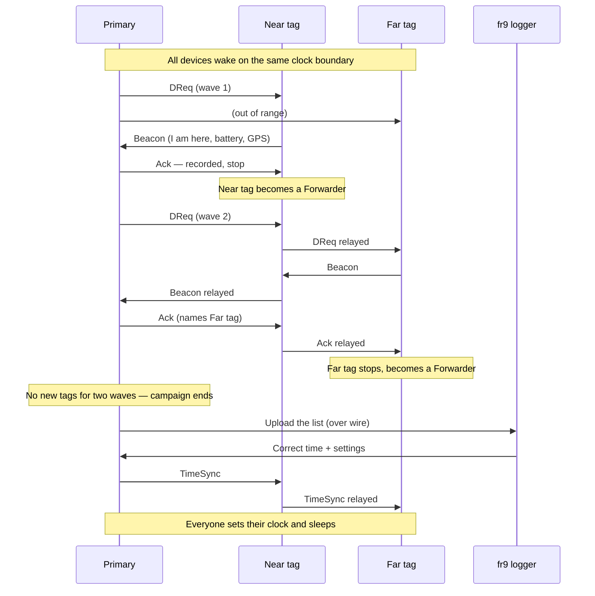
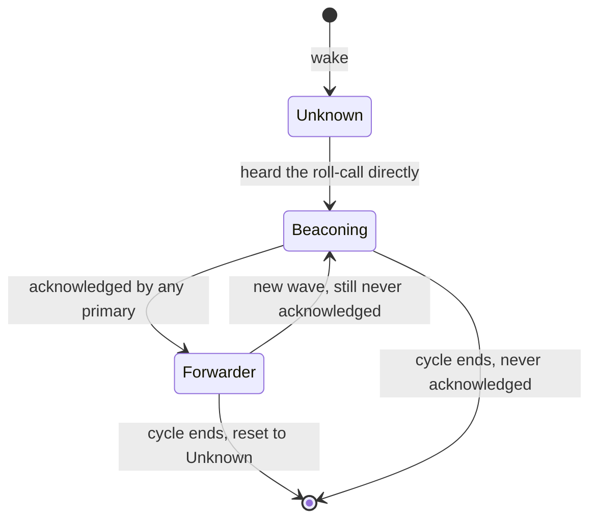
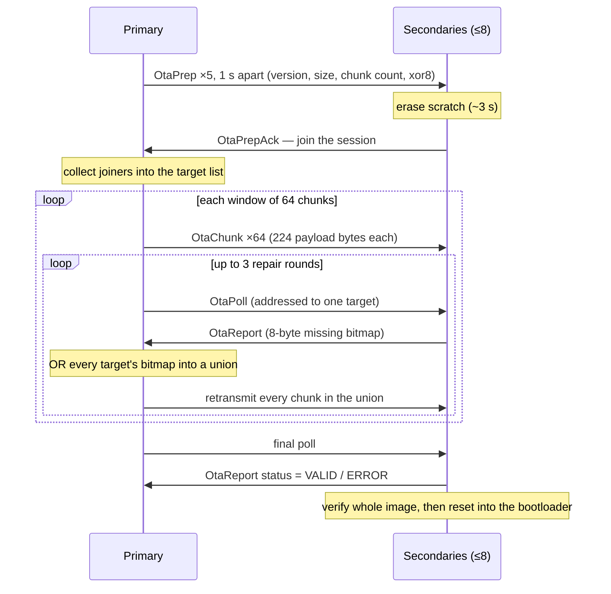

# FarmRanger Tag Mesh — Technical Handover

**Source:** `frtag2` firmware, branch `fix/mesh-robustness`, version **v2.3.8**
**Hardware:** STM32WLE5CC (Cortex-M4 + integrated sub-GHz LoRa transceiver), 868 MHz
**Audience:** written to be read top-to-bottom. Part 1 and Part 2 require no engineering background. Part 3 onward is the implementation detail.
**Status:** describes what the firmware does today, including behaviour that is known to be imperfect. Where a design is a deliberate compromise, it says so.

---

## How to read this document

| If you are… | Read |
|---|---|
| A manager, investor, or new team member who needs to understand the product | Part 0, Part 1, Part 2 — then stop at the line marked **END OF NON-TECHNICAL SECTION** |
| A field technician or support engineer | The above, plus Part 3 (what a cycle looks like) and Part 11 (reading the logs) |
| A firmware or systems engineer taking ownership | All of it. Part 4 and Part 5 are the load-bearing parts |
| Looking for a specific number | Appendix A |

## Contents

**Non-technical**
- [Part 0 — Executive summary](#part-0--executive-summary)
- [Part 1 — The system in plain language](#part-1--the-system-in-plain-language) — the cast, the heartbeat, the roll-call, waves, what comes out
- [Part 2 — The concepts, one level deeper](#part-2--the-concepts-one-level-deeper) — waves vs hops, roles, multi-primary, congestion

**Technical**
- [Part 3 — One full cycle, in order](#part-3--one-full-cycle-in-order) — wake to sleep, with a real annotated trace
- [Part 4 — Protocol reference](#part-4--protocol-reference) — radio, packet types, wire layouts, redundancy, de-duplication
- [Part 5 — Congestion control](#part-5--congestion-control) — jitter, backoff, back-pressure, CAD deafness
- [Part 6 — Time](#part-6--time) — the clock, authority, drift, the compatibility keep-alive
- [Part 7 — GPS](#part-7--gps) — configuration, the pre-trigger, fix validity
- [Part 8 — Settings distribution](#part-8--settings-distribution)
- [Part 9 — Firmware over the air](#part-9--firmware-over-the-air) — acquisition, distribution, install, hardware constraints
- [Part 10 — Power and sleep](#part-10--power-and-sleep)
- [Part 11 — Operating and diagnosing](#part-11--operating-and-diagnosing) — reading the logs, operator commands, troubleshooting
- [Part 12 — Known limits, open questions, and history](#part-12--known-limits-open-questions-and-history)

**Reference**
- [Appendix A — Constants](#appendix-a--constants)
- [Appendix B — Glossary](#appendix-b--glossary)
- [Appendix C — Notes for producing the designed document](#appendix-c--notes-for-producing-the-designed-document)

---

# Part 0 — Executive summary

FarmRanger tracks livestock. Each animal wears a **tag**: a small solar-assisted radio device with a GPS receiver. Somewhere in the herd there is one **gateway unit** — a FarmRanger collar device, which pairs the same tag hardware with a cellular modem. That gateway is the herd's only link to the outside world.

The problem this system solves is that you cannot put a cellular modem on every animal. A modem costs money, drains batteries, and needs coverage. So only the gateway has one, and the rest of the herd has to reach the gateway somehow.

The tags do this by forming a **mesh**: a self-organising radio network where tags relay for each other. A tag too far from the collar to be heard directly is heard by a nearer tag, which passes the message on. Nobody configures this. There is no map, no routing table, no addresses to assign. The network rebuilds itself from scratch every time, in under two minutes, and then switches off again.

**The whole system runs for roughly ninety seconds out of every fifteen minutes, and is completely dark the rest of the time.** That is the central constraint. Everything else in this document — the timing, the retries, the back-offs — exists because the network only gets that ninety-second window, every tag must be awake for the same ninety seconds, and radio time is the most expensive thing a battery-powered device spends.

Four times an hour, every tag in the herd wakes up at the same moment, the collar calls the roll, every tag answers, the collar writes down who answered and where they are, uploads that list over cellular, tells everyone the correct time, and the entire herd goes back to sleep.

That is the system. Everything below is detail about how it survives doing that over radio, in a field, on a battery.

---

# Part 1 — The system in plain language

## 1.1 The cast

There are four things in the system, and it helps to name them before anything else.

| Name | What it is | Where it is |
|---|---|---|
| **Tag** | The device on an animal. Radio, GPS, accelerometer, small battery, small solar panel. | On most animals in the herd |
| **Primary** | A tag whose role pin is strapped high. It runs the roll-call and talks to the logger. It has no GPS and no solar panel — it doesn't need them, because it is attached to the collar. | One (or more) per herd |
| **Secondary** | Every other tag. Answers roll-calls, relays for its neighbours. | The rest of the herd |
| **fr9 logger** | The collar's main board: cellular modem, storage, power. The primary talks to it over a short wire, not over radio. | Inside the collar, beside the primary |

"Primary" and "secondary" are decided by a single hardware strap pin read once at boot and then never again. It is not negotiated, not elected, and cannot change in the field. A primary is a primary because of how its board is wired.

The tag firmware is *identical* on both. The same binary runs on every device; the strap decides which half of the code runs.

## 1.2 The heartbeat: everybody wakes at once

Every device keeps a clock. Not a stopwatch counting from boot — a real wall-clock time, synchronised to the same universal time your phone uses.

The wake rule is deliberately trivial: **wake whenever the wall clock crosses a multiple of the wake interval.** With the default fifteen-minute interval, that is :00, :15, :30 and :45 of every hour. Every device in the herd applies the same rule to the same clock, so they all wake within a second or so of each other without ever having to agree on anything.

This is why the clock matters so much, and why the system spends effort keeping it right. Two tags whose clocks disagree by a minute are, for networking purposes, on different planets — one is awake while the other is dark.

> **Figure 1 — The duty cycle.** *For the designer: a horizontal 15-minute timeline, mostly flat/dark, with a short raised block of activity at each quarter hour. Annotate the raised block "~90–140 s awake" and the flat span "asleep, radio off, ~µA". The visual point is how small the awake slice is.*

```
 :00                      :15                      :30                      :45
  |                        |                        |                        |
 ███                      ███                      ███                      ███
 ~90-140 s awake          asleep (radio off)
```

## 1.3 The roll-call

Once everyone is awake, the primary runs a roll call. In its simplest form:

1. **The primary shouts:** "Everyone who can hear me, sound off." (This message is called a **DReq** — a discovery request.)
2. **Tags that heard it answer:** each one sends back a short message with its identity, battery voltage, last GPS position, and whether it is moving. (This is a **Beacon**.)
3. **The primary writes each answer down and confirms it:** "I've got you — you can stop." (This is an **Ack**, short for acknowledgement.)
4. **A tag that has been confirmed becomes a relay.** It stops talking about itself and starts passing other tags' messages along. (It is now a **Forwarder**.)

Step 4 is the clever part, and it is what makes the mesh work.

## 1.4 Why the roll-call is repeated: waves

The first shout only reaches tags close enough to hear the primary directly. But once those tags have been confirmed, they become relays. So the primary shouts **again** — and this time the near tags pass the shout outward, reaching a ring of tags that couldn't hear the original.

Those answer, get confirmed, become relays themselves, and the next shout reaches one ring further out.

Each shout-and-answer round is called a **wave**. Each wave reaches one ring further into the herd than the last. The primary runs up to **six** waves per cycle, which is what sets the maximum depth of herd it can map.

> **Figure 2 — Waves expanding outward.** *For the designer: concentric rings around a central collar icon. Ring 1 tags filled in after wave 1, ring 2 after wave 2, etc. Show the relay arrows going outward and the answers coming back inward. This is the single most important diagram in the document.*

```
                    wave 3
            ┌───────────────────────┐
            │        wave 2         │
            │   ┌───────────────┐   │
            │   │    wave 1     │   │
            │   │   ┌───────┐   │   │
            │   │   │ [P]   │   │   │     [P] = primary / collar
            │   │   │  o o  │   │   │      o  = tag confirmed this wave
            │   │   └───────┘   │   │
            │   │  o         o  │   │
            │   └───────────────┘   │
            │ o                   o │
            └───────────────────────┘

   wave 1: only tags that hear the primary directly answer
   wave 2: wave-1 tags relay the shout; ring 2 answers
   wave 3: ring 2 relays; ring 3 answers  … up to 6 waves
```

## 1.5 What comes out of it

At the end of the roll-call the primary holds one row per tag it heard. It hands that list over the wire to the fr9 logger, which uploads it over cellular. What the farmer eventually sees looks like this — a real capture from the field:

```
Tag ID | Hops |   RSSI |  RxDev |   Batt |  St | Waves |  Mov |  GPS |    FW
-------+------+--------+--------+--------+-----+-------+------+------+------
  121F |    1 |    -53 |    E20 |   3769 |  🔵 |     1 |    1 |    Y |     4
  1316 |    1 |   -103 |    E20 |   3829 |  🟢 |     1 |    1 |    Y |     4
   F15 |    1 |   -105 |    E20 |   3847 |  🟢 |     1 |    1 |    Y |     4
  4A1F |    3 |   -108 |    F15 |   3847 |  🟢 |     2 |    1 |    Y |     4
  1420 |    3 |    -98 |   121F |   3794 |  🔵 |     2 |    1 |    Y |     4
  3E1E |    3 |   -108 |    F15 |   3870 |  🟢 |     2 |    1 |    Y |     4
  221D |    6 |    -98 |   4A1F |   3851 |  🟢 |     3 |    1 |    Y |     4
  241F |    5 |   -108 |   4A1F |   3877 |  🟢 |     3 |    1 |    Y |     4
  2D94 |    6 |   -101 |   221D |   3839 |  🟢 |     4 |    1 |    Y |     4
Total: 9 tags
```

Reading one row: tag `2D94` answered on **wave 4**, so it is four rings deep in the herd. Its answer travelled **6 hops** to get back. The strongest signal it heard came from tag `221D` at **-101 dBm**, which tells you *which neighbour is its route in*, not just how far away it is. Its battery is at 3839 mV (healthy), it is moving, and it has a valid GPS fix.

## 1.6 Ending the cycle

When the primary has stopped finding new tags, it wraps up:

1. Uploads the list to the logger.
2. Asks the logger for the correct time and for any changed settings.
3. Broadcasts one final message — the **TimeSync** — carrying the correct time, the wake interval, and a note about whether new firmware is available.
4. Goes to sleep.

For a secondary, **hearing the TimeSync is the signal that the cycle is over.** It sets its clock from it, relays it once so the tags behind it get it too, and goes to sleep. That single message is doing three jobs at once: it ends the cycle, corrects everyone's clock, and advertises firmware updates.

> **Figure 3 — One complete cycle, end to end.** *For the designer: a swimlane sequence — lanes for Primary, a near Secondary, a far Secondary, and the fr9 logger. This is the "everything at a glance" diagram.*



## 1.7 Why it is built this way

Three constraints shaped every decision in this system.

**Battery.** A tag has a small cell and a small solar panel. Radio receive is expensive; radio transmit is more expensive. The only way to make the numbers work is to be switched off almost all the time. Hence the 15-minute duty cycle, and hence the pressure on every mechanism in this document to be *brief*.

**One shared channel.** Every device transmits and listens on the same frequency. There is no scheduling authority, no time slots, no collision detection. If two tags transmit at the same moment, both transmissions are usually lost, and neither sender finds out. A large herd answering one question simultaneously is therefore a self-inflicted outage. Most of the complexity in Part 5 exists to prevent exactly this.

**No infrastructure.** There are no base stations, no repeaters, no site survey, no per-farm configuration. The herd moves; the topology changes hourly. So the network is rebuilt from nothing every cycle rather than maintained — it is cheaper and far more robust than trying to keep a map of a herd that walks away.

---

# Part 2 — The concepts, one level deeper

Still no code in this part. These are the six ideas you need in order to follow any conversation about this system.

## 2.1 Waves and hops are different things, and people mix them up

This is the single most common misunderstanding, so it gets its own section.

- **Wave** = *how deep into the herd a tag is.* If a tag first answered on wave 3, it took three rounds of relaying for the roll-call to reach it. It is three rings out. This number is decided once, when the tag first answers, and never changes for the rest of the cycle.

- **Hops** = *how many relays that particular message passed through on its way back.* This is counted per message, and it is whatever the last copy to arrive happened to take.

They are usually close but rarely equal, and hops is almost always the larger of the two. In the field table above, tag `2D94` is wave 4 but 6 hops. That is normal: a message can wander. Radio is not a road network — a message may take a long way round and still arrive.

**Use waves to reason about herd depth. Use hops to reason about a message's path.** The firmware itself makes this distinction: it scales its own internal timers off the wave number specifically because the hop count would overstate the depth and make every compact herd wait as long as a spread one.

## 2.2 Beaconing, forwarding, and why a tag stops talking

Each secondary is in one of three states during a cycle:

| State | Meaning | What it does |
|---|---|---|
| **Unknown** | Hasn't heard anything yet, or the cycle just started | Listens |
| **Beaconing** | Has heard the roll-call and is answering | Sends its own beacon repeatedly until acknowledged |
| **Forwarder** | Has been acknowledged | Stops talking about itself; relays for everyone else |

The transition from Beaconing to Forwarder happens on being acknowledged, and **once a tag has been acknowledged that door is one-way for the rest of the cycle.** That single rule produces the outward expansion described in Part 1 — every acknowledgement both silences one talker and recruits one relay.

(There is one way back, and it is narrow: a tag that stopped beaconing because its window closed *without* ever being acknowledged will re-arm if it then hears a genuinely new wave from the same primary. That is a recovery path, not part of the normal flow.)

There is a consequence worth understanding: **the relay population only ever grows during a cycle.** Early on, few tags relay and few messages get through. Later, many tags relay and the air gets busy. The busiest moment of a cycle is somewhere in the middle, not at the start.

> **Figure 4 — Node role state machine.** *For the designer: three boxes, clearly one-way. Worth showing the "reset at next wake" arrow dashed, since it's what makes the cycle repeatable.*



## 2.3 Nobody owns anybody

A tag does not belong to a primary. This is a deliberate design decision and it has real consequences.

- Any primary's roll-call may start any tag answering.
- Any primary records and acknowledges whatever it hears, regardless of who asked.
- A tag stops answering on the **first acknowledgement from any primary**.

If a herd has two collars, both wake on the same clock boundary, both run roll-calls simultaneously, and both build partial lists. Neither list is complete, and neither primary can know what the other heard. **The two lists are merged on the server**, which is the only place with a complete view.

This is not a workaround, it is the design. Partial coverage per primary is fine and expected. The alternative — making tags belong to a primary — would mean a tag that has walked closer to the other collar goes unheard, which is worse.

> The server summary format reflects this directly: one line per reporting collar, then a merged total.
> ```
> 866049074634338,v2.3.4:9      ← this collar heard 9 tags
> Combined -> 9                  ← merged across all reporting collars
> ```

## 2.4 Two modes: advanced and basic

Everything described so far is **advanced mode** — the full mesh, with roll-calls, relaying and depth.

There is a second, much simpler mode for small remote groups. In **basic mode** there is no roll-call and no relaying at all. Each tag simply broadcasts a short beacon every few seconds during a known window, and the collar listens passively for thirty seconds every fifteen minutes and writes down whatever it hears. No mesh, no depth, no acknowledgements.

Basic mode trades range for simplicity and power. It only reaches tags within direct earshot of the collar, but it costs almost nothing and has no failure modes worth the name.

The mode is a system-wide setting owned by the server, fetched by the primary, and pushed to every tag inside the TimeSync. A tag applies the new mode before its next wake. **Cold-boot default on every device is advanced mode**, because that is the safe fallback: full information, at a cost.

## 2.5 The air is the scarce resource

Three facts, which together explain most of Part 5:

**Fact 1: transmitting makes you deaf.** Before transmitting, a device listens to check the channel is clear. On this radio, that check runs the chip in a special listening mode which *cannot receive packets*. So every transmission attempt — including the ones that back off and never transmit — is a window where the device hears nothing. A device with a lot queued to send can spend the majority of the cycle deaf. This is real: one field unit missed the primary's TimeSync in 39 of 47 cycles, and the cause was that it was too busy relaying to listen.

**Fact 2: relaying multiplies.** If every tag relays every message it hears, the number of transmissions grows with the square of the herd. Every relay is capped and de-duplicated specifically to stop this.

**Fact 3: simultaneous answers collide.** Forty tags all answering one question in the same instant is not forty answers, it is forty collisions. Every transmission is therefore delayed by a small random amount, and the size of that random window grows when the air is busy.

## 2.6 The three jobs of the final TimeSync

The message that ends the cycle is carrying more than the time:

| Field | What it does |
|---|---|
| UTC timestamp | Sets every tag's clock, which is what keeps the herd waking together |
| Wake interval | Changes how often the herd wakes (15 / 30 / 60 / 120 / 240 minutes) |
| Staged firmware version | Tells tags an update exists, so they arm themselves to receive it |
| Mode + GPS flags | Switches the herd between advanced/basic and enables/disables GPS |

Because so much rides on this one message, it is the most protected packet in the protocol: sent twice by the primary, relayed twice by every tag, never subject to the back-pressure rules that suppress other relays, and explicitly rescued from the queue-flush that runs at the end of a cycle.

---

**END OF NON-TECHNICAL SECTION** — a reader who stops here understands how the system works. Everything that follows is implementation.

---

# Part 3 — One full cycle, in order

This part walks the wake-to-sleep sequence in the order the firmware actually executes it. Timings are the configured constants; the constant names are given so they can be found in the source.

## 3.1 Before the wake — T minus 150 seconds

A background task on every secondary subscribes to a one-second heartbeat and, once per interval, fires a GPS acquisition **150 seconds before** the upcoming wake (`DEVICE_DISCOVERY_GPS_PRETRIGGER_S`).

This is a fire-and-forget request. The application task never blocks on GPS. By the time the roll-call runs, a fresh fix is either cached or it isn't, and the beacon carries whatever is there.

The lead time is a balance. A beacon will only carry a fix younger than **300 seconds** (`MESH_GPS_FIX_MAX_AGE_S`), so the fix must still be inside that window at the *end* of a cycle that can run for over two minutes. The lead was reduced from 180 s to 150 s for exactly this reason: at 180 s, field logs caught tags flipping to "no GPS" partway through a cycle and landing in the server's table with a zeroed position.

Primaries have no GPS fitted and skip this entirely.

## 3.2 T plus 0 — the wake

The wake decision is a slot latch, not an equality test:

```
slot = utc / interval_seconds
if slot > last_fired_slot:   fire, and latch
```

The naive version — "fire when `utc % interval == 0`" — was wrong in both directions: it *missed* a wake whenever the clock was stepped forward across a boundary by a TimeSync, and *double-fired* when stepped backward. The latch also handles the two pathological cases explicitly: a jump of more than one slot forward (a clock resync, typically the first sync after a cold boot with no valid time) re-latches without firing, and a large backward correction re-latches without firing.

On firing, in order:
1. Take a sleep lock, so the system cannot enter deep sleep until the cycle completes.
2. Bring up the debug UART, and on a primary, the logger UART.
3. Reset the node role to Unknown, before the radio comes up, so this cycle starts clean rather than inheriting a role from stray off-schedule traffic.
4. Wake the radio.
5. Signal the application task.

The application task then clears the neighbour table, resets the wave counter, flushes any leftover transmit queue from the previous cycle, and **waits 5 seconds** (`APP_WAKEUP_BUFFER_MS`) before doing anything. Both roles wait the same 5 seconds, which is what lines the primary's clock up with the secondaries'.

## 3.3 The primary's wave loop

```
for each wave (up to APP_PRIMARY_MAX_WAVES = 6):
    generate a fresh DReq id
    increment the wave counter
    transmit the DReq (twice — see 4.4)
    start the acknowledgement timer
    listen until a wave-end rule fires
    decide whether to run another wave
```

**The DReq id is regenerated every wave.** It is `(device id << 16) | counter`, so the top half names the primary that started the campaign and the bottom half distinguishes waves. Every downstream mechanism — beacon matching, acknowledgement matching, de-duplication — keys off this id.

**If the DReq cannot be queued** (encode failure, full queue, radio test active) the primary retries once after 500 ms and then abandons the whole campaign. This return value used to be ignored, which produced waves that listened out their full window for a question that was never actually asked.

### Wave-end rules

A wave is listening. It ends when a combination of conditions is met, and the design intent behind each is worth stating because they were arrived at by fixing real field failures.

| Condition | Constant | Meaning |
|---|---|---|
| **Floor** | `MESH_DISCOVERY_MIN_WAVE_MS` = 8000, plus `MESH_DISCOVERY_WAVE_ALLOWANCE_MS` = 4000 per proven ring, capped at `MESH_DISCOVERY_MIN_WAVE_CAP_MS` = 27000 | A wave may not end before this. Nothing means anything before the question has had time to reach the frontier and an answer has had time to come back |
| **Quiet** | `MESH_DISCOVERY_IDLE_MS` = 5000 | No beacon heard for 5 s |
| **Stale** | one floor's worth | Still hearing beacons, but nothing the table didn't already have |
| **Un-acked hold** | `MESH_DISCOVERY_UNACKED_HOLD_MS` = 33000 | A tag heard but not yet acknowledged holds the wave open — it has no reason to stop transmitting yet — but only for this long, and only for `MESH_ACK_TRIES_MAX` = 3 attempts per tag |
| **Deadline** | `APP_PRIMARY_CAMPAIGN_MAX_MS` = 140000 | The one hard stop, measured from campaign start, checked inside the wave loop |

The wave ends when: **floor has elapsed** AND **no un-acked hold is in force** AND (**quiet** OR **stale**).

Why the floor scales with depth: the round trip out to the frontier and back grows faster than linearly with depth. A flat floor is therefore always too short for exactly the outermost tags, which are the ones the extra waves exist to find. In a compact herd the scaling costs almost nothing, because the floor only grows once depth has actually been *proven*.

Why "stale" exists alongside "quiet": at nine nodes, silence is a fine proxy for "the herd has finished answering". At thirty to fifty it is not — re-beacons from already-known tags arrive indefinitely and the air never goes quiet for a full 5 s. On silence alone, one wave would run to the campaign deadline and starve every later wave, so the frontier would never advance.

Each wave logs one line recording which rule fired, so this is diagnosable after the fact rather than inferred from timestamps:

```
wave 3/6 dreq=0E209029 floor=20000 dur=20000 end=QUIET beacons=10 new=2 union=7 unacked=0
```

`end=` is one of `QUIET`, `STALE`, `HOLD-EXPIRED`, `DEADLINE`, or `RADIOTEST`.

### Campaign-end rules

After each wave the primary decides whether to continue:

- **Deadline hit** → stop.
- **Wave cap reached** (`APP_PRIMARY_MAX_WAVES` = 6) → stop.
- **Two barren waves in a row**, and at least `APP_PRIMARY_MIN_WAVES` = 2 waves have run → stop.
- Otherwise → run another wave.

"Barren" means **this wave added no row the table did not already have**. It specifically does *not* mean "no beacon was heard", and the difference caused a real bug: a beacon that de-duplicated out still stamped the "last beacon heard" tick, so a duplicate relayed copy of an already-counted beacon used to reset the barren run and keep campaigns extending. The volume of those duplicates grows with herd size, so the early-exit rule would have quietly stopped working at scale.

> **Known tension, documented rather than hidden.** `APP_PRIMARY_MIN_WAVES` is set to 2. At 2 or 3 the earliest legal barren pair is wave 2 + wave 3, and a 2026-09-09 nine-node field test showed three campaigns ending at exactly that point and dropping three deep tags a few seconds before they would have answered. Raising it past 3 is what would close that gap. It was set to 2 deliberately, as an explicit call, with this tradeoff on the record; revisit if the pattern recurs at the 30-node mesh.

## 3.4 The secondary's cycle

A secondary does not run a loop. It waits, and reacts.

```
clear the "TimeSync accepted" gate for this wake
loop, polling every 250 ms:
    if a TimeSync arrives            → cycle ends (clean)
    if an OTA prep arrives and armed → run the firmware receive instead
    if 205 s have elapsed            → cycle ends (hard cap)
    if silent for 10 s AND not beaconing AND has heard nothing → cycle ends (out of range)
```

The last rule has an important qualifier. **Silence only ends the cycle for a tag that has heard nothing at all.** Once a tag has heard *any* roll-call — directly or relayed, any wave — it knows a campaign is running and that it is inside the footprint, so quiet air means "the frontier hasn't reached my ring yet", not "nothing is out there".

This matters more than it looks. The silence reference starts at campaign start, so before this qualifier existed, a tag waiting for its wave was already 10 seconds into its own death clock at wake-up — and the deep tags, the ones the extra waves exist to find, were exactly the ones that gave up first. A tag that genuinely hears nothing keeps the old behaviour unchanged, so an out-of-range tag costs no extra power.

The 205 s cap (`APP_DISCOVERY_WINDOW_TIMEOUT_MS`) is the terminator for a tag the primary never manages to acknowledge; such a tag keeps beaconing, at a decaying rate, until the window closes.

## 3.5 What a secondary does with a roll-call

When a DReq arrives, the handler runs this sequence:

1. **Drop it if we originated it** (a primary hearing its own DReq echoed back).
2. **Count it** as foreign density — this feeds the transmit jitter window (see 5.2).
3. **Drop it if the hop count is 254 or more.** Hop 0 is the sole marker for "heard the primary directly", so a hop counter that wrapped 255→0 would present a deep relay as a direct hearer and pull the entire herd into wave 1.
4. **Latch "a campaign is running"**, which is what keeps the radio on past the silence timeout.
5. **Then one of four paths**, depending on wave number and current role.

### Wave 1 is special: a flood that does not recruit

On wave 1 only, **every** node relays the DReq (subject to de-duplication and back-pressure), not just forwarders. But only nodes that heard the primary **directly** — hop 0 — start beaconing.

The flood exists purely as a "a campaign is running, stay awake" signal to the whole herd. It deliberately does not recruit beaconers, because the whole herd answering at once is precisely the collapse the protocol is built to avoid.

The relay carries hop+1 like any other relay, and this is load-bearing: **a hop-0 frame re-sent verbatim would tell every second-hop node it had heard the primary itself**, and the entire herd would answer on wave 1. The DReq is therefore always re-encoded, never re-transmitted as received.

### Waves 2 and up

| Current role | Behaviour |
|---|---|
| Forwarder, never acknowledged, genuinely new wave from the same primary | Re-arm and start beaconing again |
| Forwarder | Relay the DReq (up to `MESH_DREQ_MAX_FORWARDS` = 2 copies per id) |
| Beaconing, same DReq id | Nothing — already answering this |
| Beaconing, newer DReq id from the same primary | **Re-anchor** onto the new id |
| Anything else | Start beaconing |

Re-anchoring is essential: a tag still beaconing an older DReq id would emit that stale id forever, and the current campaign's acknowledgements — which carry the *new* id — would never match it, so it could never be silenced.

> **Known gap, unfixed.** Re-anchoring is gated on the DReq coming from the *same primary*. So a tag already beaconing for primary A will not re-anchor onto primary B's DReq, and keeps advertising A's wave number. B records the tag anyway, but B's own listen floor is then being driven off A's idea of depth. Low impact while two primaries stay in step on the shared wake slot; it diverges when one of them ends its campaign early.

## 3.6 The beacon

A beaconing tag sends its first beacon **immediately** on the trigger, then repeats on a **backing-off** cadence:

```
interval(n) = min(5000 + n × 2000, 12000) ms       n = beacons already sent this episode
```

So the gaps run 5 s, 7 s, 9 s, 11 s, 12 s, 12 s … The counter resets to zero every time beaconing (re-)starts — a new wave, a re-anchor, a re-arm — so each fresh episode gets a prompt first answer.

The reasoning: a fixed 3.5 s period made an *unheard* tag the loudest thing on the mesh for the entire window. Field logs show one hop-3 tag emitting 48 beacons in 171 seconds, and the forwarder in front of it relaying 89 packets in the same campaign — which left that forwarder deaf for most of the window, dropping both the acknowledgement meant for the tag behind it and its own TimeSync. That is congestion collapse, and the tag beaconing hardest is what drives it. Same window under the backoff: roughly 17 beacons instead of 48.

**There is no cap on beacon count.** There used to be one (6 beacons, then stop), on the theory that it bounded wasted airtime. What it actually bounded was the tag's *chance of being found*: six beacons is about 17.5 s of a 205 s window, after which a tag the primary was still hunting for went mute. The correct thing to bound was the **rate**, not the count.

A beacon carries: the DReq id it is answering, battery voltage, hop count, the signal strength of the DReq that triggered it, a fresh message id, the wave number, move state, firmware patch version, and optionally a GPS fix and the device id of whoever sent the triggering DReq.

That last field deserves a note. The reported signal strength is **latched at the trigger** and frozen — it is the reading of the one DReq that made this tag answer, not the strongest heard during the episode. Paired with the sender's id, it answers the operationally useful question: *which of my relays actually reaches this tag?* Hop count alone cannot answer that.

## 3.7 The acknowledgement

The primary runs an acknowledgement timer every **4 seconds** (`MESH_PRIMARY_ACK_INTERVAL_MS`) for the duration of the campaign. On each tick it builds one packet listing up to **12** (`MESH_MAX_ACK_IDS_PER_PACKET`) un-acknowledged device ids and broadcasts it.

Each acknowledgement is sent **twice**, with the second copy placed in a deliberately non-overlapping delay window. The case for this is strongest for the *first* acknowledgement of a campaign, which is uniquely unprotected: acknowledgements are relayed only by forwarders, and a tag becomes a forwarder only once it has itself been acknowledged — so at the instant the first acknowledgement goes out, **no forwarders exist**. That lone unrelayed packet is the one that silences the entire first ring. A field log showed it lost, and the first ring re-beaconed until the second acknowledgement finally landed.

Rows are only marked as acknowledged **after** the packet is safely queued. A premature mark would mean those tags are never actually acknowledged on air and keep beaconing to the end of the window.

On the receiving side, a tag stops beaconing if its own device id appears in the list — **regardless of which primary sent it and which wave the id belongs to**. Earlier firmware required the acknowledging primary to match the primary whose DReq the tag had anchored to, which was described at the time as "multi-primary safe" and was the exact opposite: two primaries wake on the same slot, a tag answers whichever DReq reaches it first, and the *other* primary — which is recording the tag perfectly well — could never silence it. That tag then beaconed all campaign at a primary that already had it.

A **late acknowledgement**, arriving after the tag has already stopped, is not thrown away: if it comes from the primary this tag was talking to, the tag records that it *was* heard, so the next wave doesn't re-beacon for nothing.

## 3.8 The logger session

Once the wave loop ends, the primary, and only the primary, talks to the fr9 logger over a wire:

| Step | Command | Purpose |
|---|---|---|
| 1 | `AT+LOG=<len>,<primaryVersion>` | Announce the upload; wait for "Logger ready" |
| 2 | *(payload)* | Stream one tab-separated row per tag, paced ~10 ms apart |
| 3 | *(verdict)* | Wait up to 6.5 s for OK/ERR; up to 3 attempts |
| 4 | `AT+TSREQ` | Fetch authoritative UTC and set the RTC |
| 5 | `AT+SETREQ` | Fetch wake interval, mode, GPS-enabled — one round trip, all three |
| 6 | — | Send the TimeSync over radio |
| 7 | `AT+FWCHECK` / `AT+FWREQ` | Ask whether newer firmware is available |

Row format, which must stay in step with the fr9's printed header:

```
DeviceId, Hops, Wave, RSSI, BatMv, Move, Lat, Lon, FwPatch, RssiSrc
```

The pacing is not cosmetic. The fr9 receives into a 128-byte UART ring drained by a cooperative loop that echoes every byte to USB; streaming the whole payload at line rate overflows that ring and the fr9 never counts the full length, which it reports as a log timeout.

**The TimeSync is sent before the firmware check, not after.** The firmware check can block for a long time while the fr9 talks to its update host, and secondaries are sitting awake waiting for the TimeSync to release them.

## 3.9 The TimeSync, and the end of the cycle

The primary broadcasts one TimeSync carrying UTC, wake interval, staged firmware version, mode and GPS flags. It is sent twice.

Every secondary that hears a *newer* UTC than the last one it saw will:
1. Evaluate the firmware advertisement and arm itself if an update exists.
2. If this is the first TimeSync this wake: set the RTC, apply interval/mode/GPS, and notify the application task (which ends the cycle).
3. **Relay it twice**, regardless of whether it applied it.

The de-duplication is keyed on the **UTC value**, not on a message id. This is deliberate: raw epoch seconds numerically collide with message ids from devices whose ids fall in the current-epoch numeric range, which silently dropped those devices' packets as "already seen".

The firmware-arming check sits *above* the once-per-wake gate. On a two-primary herd, only one primary may be holding the new image; a tag that heard the imageless one first used to latch the gate and never look at the other primary's advertisement at all.

Then everything is torn down:
- Flush the transmit queue — **but keep any pending TimeSync relay**. On a secondary this flush runs the instant a TimeSync is received, which is exactly while its own relay of that TimeSync is still waiting out its jitter. Dropping it left the tags behind it unsynchronised, every time. The field signature was unmistakable: the 1-hop secondary heard its TimeSync in 6 of 7 wakes while the 3-hop and 5-hop ones heard it in 4.
- Log the campaign statistics line.
- Reset the node role, clear the de-duplication rings.
- Radio to deep sleep, release the sleep lock, MCU to STOP2.

## 3.10 A real cycle, annotated

Primary `E20`, 2026-09-08 20:00, nine-tag herd:

```
20:00:00  --- WAKEUP ---                                    clock boundary
20:00:05  Primary starting discovery campaign                after the 5 s buffer
20:00:05  DReq 0E209020 sent                                 wave 1
20:00:09  DAck 0E209021 ids=3 remaining=3                    first three tags silenced
20:00:13  DAck 0E209022 ids=1 remaining=1
20:00:17  DAck 0E209023 ids=1 remaining=1
20:00:21  wave 1/6 floor=12000 dur=16500 end=STALE  new=4 union=4 unacked=0
20:00:21  DReq 0E209025 sent                                 wave 2
20:00:37  wave 2/6 floor=16000 dur=16000 end=QUIET  new=1 union=5
20:00:37  DReq 0E209029 sent                                 wave 3
20:00:57  wave 3/6 floor=20000 dur=20000 end=QUIET  new=2 union=7
20:00:57  DReq 0E20902E sent                                 wave 4
20:01:25  wave 4/6 floor=24000 dur=27500 end=QUIET  new=1 union=8
20:01:25  DReq 0E209035 sent                                 wave 5
20:01:49  wave 5/6 floor=24000 dur=24000 end=QUIET  new=0    barren
20:01:49  DReq 0E20903B sent                                 wave 6
20:02:13  wave 6/6 floor=24000 dur=24000 end=QUIET  new=0    barren
20:02:13  Primary wave cap (6) reached
20:02:13  campaign stats - DReq heard=44 beacons heard=33 acks heard=31
                           forwarded=0 cadTmo=0 txDrop=0 jitterMax=4000
20:02:13  Final UNION: 8 neighbors
20:02:14  Logger connected / AT+LOG=368 / verdict='O' / Log SUCCESS
20:02:15  settings applied - interval=15 min, mode=advanced, gps=1
20:02:15  TimeSync sent 1788897735 interval=1 fwVer=20304
20:02:35  Waiting for synchronized wake-up...                asleep
```

Total awake time: **155 seconds**. The same cycle seen from secondary `4A1F`, three hops out:

```
20:00:00  --- WAKEUP ---           solar: Vsolar=3 mV   (dark — 8 pm)
20:00:05  Secondary waiting for timesync
20:00:20  Sending Beacon 4A1F1A19 move=1 gps=1 age=159s
20:00:20  Start beaconing dreq=0E209025                  answered wave 2
20:00:25  Sending Beacon 4A1F1A1A move=1 gps=1 age=164s  second beacon, 5 s later
20:00:26  beacon episode end dreq=0E209025 reason=ACKED-BY-0E20 beacons=2
                                    trigRssi=-111 trigSrc=1316
20:02:15  TimeSync applied: 1788897735 interval=1
20:02:15  TX flush kept 24 queued TimeSync
20:02:15  campaign stats - DReq heard=39 beacons heard=29 acks heard=21
                           forwarded=23 jitterMax=3840
20:02:20  Waiting for synchronized wake-up...
20:12:31  gps: session armed (cold start), ttff timeout=120s   T-150 s pre-trigger
20:12:41  gps: FIX OK t=11s/120s lat=-33.963911 lon=18.837248
20:12:41  gps: powered off
20:15:00  --- WAKEUP ---                                       next cycle
```

Note `trigSrc=1316` — this tag's route in is via tag `1316`, not via the collar. And note the GPS fix landing at T-139 s with a fix age of 159 s at beacon time, comfortably inside the 300 s limit.

---

# Part 4 — Protocol reference

## 4.1 Radio layer

| Parameter | Value |
|---|---|
| Frequency | 868 MHz |
| Transmit power | 15 dBm |
| Bandwidth | 250 kHz |
| Spreading factor | 7 |
| Coding rate | 4/5 |
| Preamble | 8 symbols |
| Sync word | `0x1424` |
| Max PHY packet | 256 bytes |
| Frame integrity | Hardware LoRa CRC, plus a software XOR-8 byte appended by the radio layer |

The XOR-8 is deliberately weak and is known to be weak — roughly 1 in 256 corrupted frames passes it. Every packet handler is written to be safe against a frame that gets through: length gates before every optional field, and explicit range checks on any count byte that indexes a buffer.

All multi-byte fields are **big-endian** on the wire.

## 4.2 Packet types

| Value | Name | Direction | Size | Relayed? |
|---|---|---|---|---|
| 0 | Reserved | — | — | Radio range test beacon only |
| 1 | `DReq` | Primary → all | 9 B | Yes, budgeted |
| 2 | `DBeacon` | Secondary → all | 17 / 19 / 25 / 27 B | Yes, de-duplicated |
| 3 | `DAck` | Primary → all | 10 + 4×n, max 58 B | Yes, by forwarders |
| 4 | `TimeSync` | Primary → all | 11 B | Yes, twice per node |
| 5 | `FrKernel` | Operator commands | var | No |
| 6–10 | `OtaPrep` … `OtaReport` | Firmware distribution | var | **Never** — direct only |
| 11 | `BasicBeacon` | Secondary → primary | 13 / 25 B | No |

## 4.3 Wire layouts

**DReq — 9 bytes**

```
[0]     type = 1
[1..4]  DreqId            (origin primary's 16-bit id in the top half)
[5]     SenderHopCount    (this hop's depth; 0 = straight off the primary)
[6]     WaveCnt
[7..8]  SenderId          (THIS hop's own device id, re-stamped at every relay)
```

The sender id is what makes "which neighbour is my route in" answerable. The DReq id names the primary that *started* the campaign and is re-emitted unchanged by every relay, so without a per-hop field a receiver could not tell which neighbour actually transmitted the frame it just heard — and the strongest DReq of a wave is very often a peer's relay, not the primary's original.

**DBeacon — 17 bytes base, extended by optional fields**

```
[0]       type = 2
[1..4]    DreqId            the request this beacon answers
[5..6]    BatMv
[7]       HopCount          incremented at every relay
[8..9]    Rssi              of the triggering DReq, latched
[10..13]  BeaconMsgId       top half is the sender's device id
[14]      dreqWaveDisc      the wave this tag started beaconing on
[15]      flags             STILL, GPS_VALID, RSSI_SRC
[16]      FwPatch
[17..20]  LatUDeg           only if GPS_VALID
[21..24]  LonUDeg           only if GPS_VALID
[17..18]  BestRssiSrcId     only if RSSI_SRC and NOT GPS_VALID
[25..26]  BestRssiSrcId     only if RSSI_SRC and GPS_VALID
```

Note that the sender's device id is **not a field** — it is derived from the top half of the beacon message id.

The signal-source id is *appended after* the GPS block rather than inserted at offset 17, and the reason is a compatibility rule that applies across this whole protocol: **a new field must only ever land past everything an older decoder reads.** Inserting it at 17 and shifting latitude/longitude to 19..26 would be read by an un-updated peer at its hardcoded offsets and yield a plausible but wrong position.

**DAck — 10 + 4n bytes**

```
[0]      type = 3
[1..4]   AckMsgId
[5..9]   DreqId, AckCount
[10..]   AckedIds[]        4 bytes each, up to 12
```

There is a `SenderId` field in the in-memory struct that is **not on the wire** and never has been; the acknowledging primary is identified by the top half of the DReq id instead.

**TimeSync — 11 bytes**

```
[0]      type = 4
[1..4]   UtcTimestamp
[5]      WakeupInterval    enum: 1=15min, 2=30, 3=60, 4=120, 5=240
[6..9]   StagedFwVersion   MMmmpp, 0 if none
[10]     flags             bit0 GPS_ENABLED, bit1 BASIC_MODE
```

Byte 10 is a later addition. An older peer that emits a 10-byte TimeSync decodes as advanced mode + GPS enabled, which is exactly how those nodes behaved before the flags existed — so the 10→11 byte change is compatible in both directions.

## 4.4 Redundancy: everything important is sent twice

| Packet | Constant | Copy 1 | Copy 2 |
|---|---|---|---|
| DReq (primary origination) | `MESH_DREQ_ORIGIN_AIRINGS` = 2 | normal jitter | 1600–2600 ms window |
| DReq (relay) | `MESH_DREQ_MAX_FORWARDS` = 2 | normal jitter | 1600–2600 ms window |
| DAck | `MESH_DACK_AIRINGS` = 2 | normal jitter | 1600–2600 ms window |
| TimeSync (origination and relay) | `MESH_TIMESYNC_AIRINGS` = 2 | normal jitter | 1600–2600 ms window |
| Beacon | — | covered by the repeating cadence instead | |

The second-copy window (`MESH_DREQ_FWD2_DELAY_MIN_MS` = 1600, `_MAX_MS` = 2600) **replaces** the normal jitter for that packet rather than adding to it, so the two copies cannot land inside one congestion window. A collision that killed copy 1 is then unlikely to kill copy 2, which is the entire point.

**This does not amplify traffic**, and that is the part worth being sure of. Both copies carry the same id, and the receive side is governed by a per-id **forward count**, not by "have I seen this". A node that hears both copies spends its existing two-relay budget on them instead of on one primary copy plus one peer's relay. The number of relays it emits is unchanged. The only added airtime in the entire mesh is the primary's own extra ~10-byte transmission, once per wave.

> **Caveat on the "non-overlapping" claim.** The copy-1 jitter window can now widen to 4000 ms under load (see 5.2), which is past the 1600 ms start of the copy-2 window. The non-overlap guarantee therefore holds at low density and degrades at high density. This is flagged as unverified in the 2026-09-08 field review and has not been re-derived.

## 4.5 De-duplication

Two separate stores, for two different reasons.

**The forward ring** — 48 slots, shared between received beacon ids, received acknowledgement ids, and this node's own beacon and acknowledgement ids. It stores a **16-bit fingerprint** (the two halves of the 32-bit id XORed together), not the id itself, which is what buys 48 slots out of the same 96 bytes that a 24-slot 32-bit ring occupied.

The ring is not merely an optimisation — for beacons, **the ring is the relay cap.** Unlike every other packet class, a beacon relay has no explicit airing budget; the rule is "relay each beacon once per node", and that only holds while the id is still in the ring when the next copy arrives. At 24 slots that stopped holding at herd scale: a 40-node herd pushes 80–120 beacon ids plus acknowledgements through one campaign, so an id was evicted within a fraction of a second of busy traffic and the same node re-relayed the same beacon on the next lap.

Folding to 16 bits makes a false "already seen" possible. The cost of one is one relay not made, or on the primary one beacon not recorded; the node re-beacons regardless, so it is self-healing. The odds are about 48/65536, roughly 1 in 1400 — far below the CRC and header error rate already present in field logs. The fold mixes the device id into the stored value specifically so that collisions are random rather than systematic: keeping the low half alone would have let two devices sitting on neighbouring counters shadow each other's every packet for a whole deployment.

**The DReq store** — 8 entries, separate from the ring, with a 2-bit forward count per slot. DReq ids get their own store because the ring's churn would evict them within a second, and the wave-1 flood has *every* node relaying — an evicted id would let the same DReq be re-forwarded on every lap around the mesh.

Both stores are cleared at campaign start. Ids never repeat across campaigns, so stale entries could not cause a false positive; they simply occupied slots the current campaign needs.

## 4.6 The transmit path

```
 handler / timer
       │
       ▼
 mesh TX queue  ── 24 items × 64 B, each stamped with a "not before" tick
       │
       ▼
 MeshTx task    ── waits out each item's jitter, then hands it down
       │
       ▼
 radio TX queue ── 8 items, at most 2 drained per pass
       │
       ▼
 carrier sense  ── CAD, up to 5000 ms, chip cannot receive during this
       │
       ▼
 transmit
```

Two independent age-outs protect this path. The mesh layer refuses to queue anything over 64 bytes. The radio layer **discards any packet more than 10 seconds old** (`LORA_TX_MAX_AGE_MS`) rather than transmitting it — a mesh relay whose moment has passed only feeds the congestion that delayed it.

Timer callbacks never build packets. The beacon and acknowledgement timers run in the FreeRTOS timer service task, which has a small stack; building a packet there — struct, encode, and a formatted log line pulling in `vsnprintf` — overflows it. The callbacks therefore do nothing but set a thread flag, and the MeshTx task, which has a full-size stack, does the construction.

---

# Part 5 — Congestion control

This part collects the mechanisms that keep the channel usable. They are the reason the system works at thirty nodes and not just at nine.

## 5.1 The core problem: carrier sense makes you deaf

Before transmitting, the radio performs a **Channel Activity Detection** (CAD) check — up to 300 ms per attempt, with exponential backoff from 100 ms to 2000 ms across retries, and a total budget of 5000 ms per packet (`LORA_TX_CARRIER_WAIT_MS`).

The critical property: **CAD is not receive.** The chip is in a different mode, with no receive-done interrupt mapped. Every millisecond spent in carrier sense is a millisecond the node cannot hear anything.

So the cost of channel contention on this system is not primarily lost packets — carrier sense makes the channel *correct* by serialising contention. The cost is **deafness**. A node with a deep transmit queue spends its cycle in CAD and misses the packets that matter to it.

Every mechanism below is ultimately aimed at keeping transmit queues shallow.

> **Figure 5 — Why a busy relay goes deaf.** *For the designer: two parallel timelines for one node. Top: "what the node is doing" alternating RX / CAD / TX blocks. Bottom: "packets on the air", with the ones arriving during CAD blocks struck through. The message: the packets it misses are not random — they cluster exactly where it was busy talking.*

## 5.2 Transmit jitter, and why it grows

Every mesh transmission is held for a random delay before going out.

| Constant | Value | Role |
|---|---|---|
| `MESH_TX_JITTER_MIN_MS` | 20 | Floor |
| `MESH_TX_JITTER_MAX_MS` | 1500 | Ceiling on a quiet channel |
| `MESH_TX_JITTER_BUSY_MS` | 4000 | Ceiling when the air is busy |
| `MESH_TX_JITTER_STEP_MS` | 60 | Growth per foreign DReq copy heard |

```
ceiling = min(1500 + 60 × DReqsHeard, 4000) ms
delay   = 20 + random(0 … ceiling − 20)
```

A fixed 1500 ms window is sized for a handful of answerers and collapses at herd scale. Forty tags answering one DReq is roughly 40 × 33 ms = 1.3 s of transmission offered into a 1.5 s window — about 88% load, with collision probability climbing roughly as the square of that. Widening to 4000 ms puts the same load at about 33%.

**Why the density signal is DReq copies and not beacons heard:** on wave 1 every node relays the DReq twice, so a node in a dense herd hears many copies within the first seconds — *before* it answers. A beacon count only rises after the burst it is supposed to spread out.

4000 ms is the largest value that required no other constant to move. Two invariants are enforced at compile time:

```
MESH_BEACON_BASE_MS   (5000) > 4000   a queued packet cannot slip past the next beacon
MESH_DISCOVERY_IDLE_MS (5000) > 4000  a jittered beacon cannot be mistaken for silence
```

> **Two known limitations.**
> 1. The **first** beacon of an episode fires immediately on the trigger, when the local density count may still be low. It is the one transmission this cannot spread. Fixing it properly needs the primary to advertise herd size in a DReq hint byte — there is room, and the length-gated field pattern is established, but it is a wire change and has not been done.
> 2. The density counter was, until recently, incremented *above* the self-origin guard, so a **primary counted its own DReqs** — echoed back by every relaying node — into its own density signal. Measured DReq-heard on the field primary reached 44 per campaign against a saturation point of 42, so the primary was driving its jitter ceiling to maximum off its own transmissions. That is fixed at HEAD (the increment now sits below the guard), but any field log from v2.3.4 or earlier shows the old behaviour, and `DReq heard=44` lines in those logs are not measuring what they appear to.

## 5.3 Beacon backoff

Covered in 3.6. The short version: within one beaconing episode the interval grows 5 s → 7 s → 9 s → … → 12 s, and resets to 5 s on any fresh trigger. It bounds the *rate* at which an unheard tag talks without bounding how long it keeps trying.

The base interval (5000 ms) is deliberately above both the jitter ceiling (4000 ms) and the second-copy DReq delay (2600 ms), so a queued packet can never slip past the next beacon. Both relationships are compile-time asserted.

## 5.4 Acknowledgement cadence

4 seconds per acknowledgement, 12 ids per packet.

The cadence was raised from 2 s to 4 s on direct evidence: across five campaigns, not one acknowledgement carried more than 2 ids (81 carried one, 35 carried two), because at 2 s the tick kept outrunning the arrival rate. Each of those near-empty acknowledgements was then re-flooded roughly three times by the forwarders. Holding twice as long roughly halves the acknowledgement packet count and doubles the ids per packet for the same information.

The extra hold is free **only because** the beacon base interval (5000 ms) exceeds it: a tag waiting one more acknowledgement period was going to be silent for that period anyway, so no additional beacon is provoked. `MESH_PRIMARY_ACK_INTERVAL_MS > MESH_BEACON_BASE_MS` is a compile-time error.

The id count was raised from 8 to 12 for a different reason: at 8 ids per 4 s the primary can silence only 2 tags per second, so a 40–50 tag herd needs 20–25 seconds of acknowledgement passes before the last ring is even addressed — and every tag still un-acknowledged is still beaconing over the top of the ones that are. Twelve ids puts a full acknowledgement at 58 bytes, still inside the 64-byte queue item, with a compile-time assert holding the line.

## 5.5 Back-pressure

A node whose mesh transmit queue is **half full or more** refuses to queue further *relay* traffic.

This applies to beacon, DReq and acknowledgement relays. It does **not** apply to TimeSync — rare, and the one packet the whole mesh depends on — nor to a node's own transmissions.

A well-placed relay can hear 300+ beacons in a campaign. Without back-pressure it queues relays faster than a congested channel drains them, fills the queue, and then drops at the tail anyway — having already committed the airtime and latency of everything ahead. Refusing early keeps the queue shallow, which is what keeps the radio cycling back to receive.

Back-pressure skips are counted only in diagnostic builds, and deliberately not in the production drop tally: **a rising back-pressure count is the mechanism working**, and folding it into "packets dropped" would make that number climb precisely when things are going well.

## 5.6 Queue flushes

The transmit queue is flushed twice per cycle.

**On wake**, dropping everything: a relay that survived deep sleep would otherwise air a 15-minute-old timestamp. This one must *not* keep a pending TimeSync, because the receiver's de-duplication only rejects a TimeSync it has already seen — a node that missed the original would happily apply a quarter-hour-old one.

**At campaign end**, keeping any pending TimeSync, for the reason given in 3.9.

## 5.7 What this adds up to

| Mechanism | Bounds |
|---|---|
| Jitter (density-scaled) | Simultaneous transmissions |
| Beacon backoff | How loud an unheard tag is |
| Forward ring (48) | Beacon relay multiplication |
| DReq forward budget (2) | DReq relay multiplication |
| Acknowledgement cadence + batch size | Acknowledgement packet count |
| Back-pressure (queue ≥ 50%) | How deep a relay's queue can get |
| Packet age-out (10 s) | Stale relays feeding congestion |
| Drain limit (2 per pass) | How long the radio stays away from receive |
| Wave floors | Waves ending before answers can arrive |
| Barren-wave rule | Campaigns running longer than they are useful |

Measured at ten nodes in the field: `cadTmo` is zero everywhere except one unit (13 over three days), and `txDrop` is 0–1. **At that scale there is no measured carrier-sense deafness.** The mechanisms above are sized for thirty to fifty nodes, which is the deployment they were built for and which has not yet been measured.

---

# Part 6 — Time

Everything in this system is downstream of the clock. If the clock is wrong, tags wake at the wrong moment and the network does not exist.

## 6.1 What the clock actually is

There is a real-time clock peripheral driven by a 32.768 kHz crystal (LSE, low drive). It is configured to produce **one interrupt per second** — and that is nearly all it is used for.

The system's notion of wall-clock time is **not** the RTC's calendar registers. It is a plain 64-bit counter in RAM, incremented by the one-second interrupt, plus an offset:

```
UTC = ram_tick_counter + offset
setUTC(t) → offset = t − ram_tick_counter
```

Three consequences follow, and all three matter operationally:

1. **The clock does not survive a reset.** The counter is not in the backup domain. After any reset the device believes it is roughly 7195 seconds past the epoch, and stays wrong until a TimeSync (secondary) or an `AT+TSREQ` (primary) lands.
2. **Setting the time is instant and monotonic in effect** — it moves an offset, not a hardware counter, so there is no risk of a partially-applied calendar write.
3. **The hardware calendar is read only for the tickless-sleep path**, to work out how long the MCU was in STOP2 and advance the RTOS tick accordingly.

This is why the slot-latch wake rule (3.2) has explicit handling for large forward jumps: the *first* successful time sync after a cold boot is always a jump of roughly fifty-five years, and it must not be allowed to trigger a campaign.

## 6.2 Who is authoritative

```
Cellular / server
      │  (fr9's own path)
      ▼
   fr9 logger
      │  AT+TSREQ, over wire
      ▼
   Primary  ← authoritative for the herd
      │  TimeSync, over radio, relayed
      ▼
  Secondaries
```

A primary **refuses** a TimeSync from another primary — it has authoritative time from its logger, and accepting a peer's would also prematurely end its own campaign.

A secondary applies **the first TimeSync it accepts per wake**, and only if the UTC is strictly newer than the last one it saw. Later TimeSyncs in the same wake are still relayed, but do not re-apply.

A secondary has one independent correction path: if it obtains a GPS fix and the GPS UTC differs from its own by more than **5 seconds**, it sets its clock from GPS. This is what keeps a tag that has been out of mesh range for a long time from drifting far enough to miss its wake slot entirely.

## 6.3 Drift tolerance

**There is no stated drift budget anywhere in the firmware.** No ppm figure, no measured-drift comment. The RTC smooth-calibration routine exists (`HAL_RTC_vApplyCalibration`, clamped to ±487 ppm) but **is never called** — it is effectively dead code.

Drift tolerance is therefore *structural* rather than budgeted. Four things absorb it:

| Mechanism | What it covers |
|---|---|
| 5 s wake buffer, applied identically by both roles | Small differences in when devices come up |
| Slot latch with forward/backward jump handling | A clock stepped across a boundary by a sync |
| 205 s secondary window against a 140 s primary deadline | 65 s of slack on the far end |
| "A tag that heard a DReq never bails on silence" | A tag whose ring is reached late |

The only place a guard band is named explicitly is basic mode, where the secondary's transmit window opens `DEVICE_DISCOVERY_BASIC_TX_GUARD_S` = 5 s before the primary's listen window and closes 5 s after it, described in the source as absorbing "the primary's ~5 s wake buffer plus RTC drift between nodes."

Field measurement, 2026-09-08: **clock skew primary → secondary measured at 0 seconds**, which is what made cross-log timestamp arithmetic valid in that review.

> **Open question for whoever owns this next.** The system's drift tolerance has never been characterised. The relevant number is: how long can a tag go without a TimeSync before it misses its wake slot? With a 5 s buffer and a 15-minute interval, the answer is likely hours to days — but it is a calculation nobody has done, and the tiered recovery machine that would have handled the failure is not compiled into the shipping build (see 10.4).

## 6.4 The compatibility keep-alive

One timing mechanism exists purely for mixed-fleet compatibility and should be removed when it is no longer needed.

Firmware v2.1.3 ends a secondary's wake after 10 seconds of radio silence whenever it is not beaconing — without the "have I heard a campaign" qualifier that only exists from 2.3.x. But under the current release, a wave that turns up nobody new and has nothing un-acknowledged **transmits nothing at all for its entire floor**, which is at least 12 s and can be 27 s.

Worse, that silence falls immediately before the TimeSync — the one packet carrying the clock and the staged firmware version. So the tags most likely to sleep through the advertisement are in the primary's own direct earshot, which is exactly the population a firmware distribution can serve.

The fix: when an acknowledgement tick finds nothing to acknowledge, and the air has been quiet for `MESH_KEEPALIVE_QUIET_MS` = 3000 ms, and the primary knows of at least one tag, it airs an **empty acknowledgement** — zero ids.

Why that specific packet shape: v2.1.3's acknowledgement handler stamps its activity tick *first*, then de-duplicates and returns, so the frame keeps the tag awake and is never forwarded; and with a zero id count, the "am I in this list" loop body cannot execute. Nothing else in the packet is read. A new packet type would not have worked at all — v2.1.3 only stamps the tick inside individual handlers, so an unrecognised first byte reaches its `default:` case and keeps nothing awake.

The keep-alive uses **one fixed message id per device**, forever, which is what makes it unforwardable: once the first one is in a node's de-duplication ring, every later one is suppressed before it can be relayed.

**This should be deleted** — along with its compile-time assert and the branch that calls it — once no v2.1.3 unit remains in the field. It buys a 2.3.x secondary nothing, and it spends airtime in exactly the quiet spans the deep-wave floors exist to provide.

---

# Part 7 — GPS

## 7.1 Hardware and configuration

Receiver is a **u-blox MAX-M10S**, fitted on **secondaries only** — primaries have no GPS, because a primary is attached to a collar that has its own position source.

On a cold start the driver powers the module and sends four `UBX-CFG-VALSET` frames configuring:

- 1 Hz navigation rate
- **GPS L1C/A only** — GLONASS, Galileo, BeiDou, QZSS and SBAS are all disabled, for power
- NMEA output trimmed to RMC + GGA + GSV
- Full power mode (not the receiver's own power-save mode)
- Pedestrian dynamic model

Configuration is written to `RAM|BBR` layers, and BBR is retained on the backup supply, so this only has to be re-applied on a true cold start. The sequence is sent **twice**, at +300 ms and +1000 ms, as a hedge against a slow module boot. A hot re-arm from a held fix flushes the UART buffer and does no reconfiguration at all.

## 7.2 The pre-trigger

This is the concept that makes GPS affordable here.

The application task **never blocks on GPS.** Instead the wake-schedule task fires a fix request **150 seconds before** each scheduled wake (`DEVICE_DISCOVERY_GPS_PRETRIGGER_S`), fire-and-forget, with a 120 s time-to-first-fix bound and automatic shutdown on completion. By the time the roll-call runs, a fresh fix is cached or it is not, and the beacon carries whatever is there.

The request is slot-latched exactly like the wake trigger, for the same reason: the previous implementation compared against one exact second of phase and silently skipped the pre-trigger whenever that single heartbeat second was missed.

The lead time is a two-sided constraint:

- **Too long** and the fix ages out mid-campaign. A beacon only carries a fix younger than `MESH_GPS_FIX_MAX_AGE_S` = 300 s. At the old 180 s lead, beacons stayed GPS-valid only to about wake+120 s — field logs caught a tag flipping to `gps=0` at wake+147 s, mid-campaign, and its row in the server's table then carried `Lat:0 Lon:0`.
- **Too short** and the fix isn't ready. 150 s still clears the 120 s TTFF timeout with margin. Observed TTFF in this deployment: **8–34 seconds**.

A fix older than 300 s is **dropped rather than sent**. A stale position is worse than no position: it says the animal is somewhere it demonstrably is not.

> **Figure 6 — GPS pre-trigger timing.** *For the designer: a timeline from T-150 s to T+140 s. Mark the GPS-on block (~11–34 s), the fix moment, the 300 s validity window shaded, and the campaign block. The visual point is that the validity window must cover the whole campaign, and at a 180 s lead it didn't.*

```
 T-150s        T-139s                    T+0        T+140s       T+150s
   │             │                        │           │            │
   ├─ GPS on ────┤ FIX                    │ campaign  │            │
   │  (TTFF 11s) │                        ├───────────┤            │
   │             └──── fix valid for 300 s ────────────────────────┘
                                          ^                        ^
                                     wake starts        last moment a beacon
                                                        may still carry it
```

## 7.3 Fix quality and failure

A fix is only accepted as stable against explicit criteria: a minimum of 5 valid fixes (nominally 30), a maximum lat/long delta between consecutive fixes, and an estimated position error of nominally 5 m, at most 10 m.

The TTFF deadline is enforced in **two** places — inside the solution handler and again on a 5-second wall-clock poll in the dispatcher — because a receiver that never achieves a fix may emit no position sentence at all, and the handler-side check would then never run.

On timeout or completion, the driver drops the module's power-enable line, disables the UART, and **releases the deep-sleep lock it owns**. The GPS session owns its own sleep lock independently of the campaign's, which is what allows an in-flight GPS session to overlap a wake without either leaking or double-releasing a lock.

GPS is gated strictly on `POWER_CLASS_NORMAL`. A tag in the LOW power class still wakes and still discovers — it just does so without a fresh fix (see 10.3).

GPS can also be disabled fleet-wide from the server: the `bGpsEnabled` flag in the TimeSync turns every fix request into a no-op, while the cached last-known fix keeps ageing. Two paths deliberately **override** that flag with a forced request: waking from ProductionSleep and waking from SolarSleep, because a device that has just spent an unbounded stretch asleep with no clock correction is exactly the case most likely to have a drifted RTC.

---

# Part 8 — Settings distribution

## 8.1 There is no settings protocol

This is worth stating plainly because it is easy to assume otherwise: **there is no settings packet, no settings push, and no per-device configuration over the air.**

What exists is three system-wide fields riding inside the TimeSync that every campaign already sends:

| Field | Values | Effect |
|---|---|---|
| Wake interval | 15 / 30 / 60 / 120 / 240 minutes | How often the whole herd wakes |
| Discovery mode | advanced / basic | Full mesh, or passive beacon collection |
| GPS enabled | on / off | Whether fix requests do anything |

Provenance is one `AT+SETREQ` round trip from the primary to its logger, answered as `"<interval>,<mode>,<gps>"`. All three must parse or the whole response is rejected and the primary keeps its previous values — a partial apply is considered worse than no apply.

(A quirk worth knowing when tracing a setting back to the server: discovery mode is stored on the fr9 side under an unrelated-sounding movement-alarm field name.)

## 8.2 How a setting takes effect

```
server → fr9 → (AT+SETREQ) → primary → (TimeSync, relayed twice per node) → all tags
```

- **Broadcast only.** There is no way to address a setting to one tag over the mesh. Per-device changes are made with the operator command shell (Part 11.4) over a direct link.
- **Applied on the first accepted TimeSync of a wake**, gated by the same once-per-wake flag as the clock.
- **No reboot required.**
- **Not persisted.** The setters write plain RAM variables. Nothing goes to flash.

That last point has a real operational consequence: **every power cycle reverts a tag to the cold-boot defaults — 15-minute interval, advanced mode, GPS on — until the next TimeSync reaches it.** For interval and GPS this is mostly harmless. For mode it means a herd configured for basic mode will have any rebooted tag running advanced mode for up to one wake interval.

The cold-boot defaults were chosen to be the safe fallback rather than the common case: advanced mode produces full mesh information at a cost, which is the right way to fail.

A note on `fr_app/settings/` — that directory is a **separate, unrelated subsystem** holding compile-time defaults for movement-alarm thresholds and timezone schedules. None of it is distributed over the mesh, and it should not be confused with the three fields above.

---

# Part 9 — Firmware over the air

Firmware distribution is the highest-stakes operation the system performs. A bad discovery campaign costs one cycle of data. A bad firmware distribution can put an entire fleet into a permanent install loop recoverable only by physically wiring to each device. The design reflects that asymmetry throughout.

## 9.1 The chain

```
   build  →  GitHub Pages host  →  fr9 logger  →  primary (ext flash)  →  secondaries  →  bootloader
             ↑                     ↑              ↑                       ↑               ↑
             manifest              size+xor8      xor8 + identity         xor8 + identity  version + xor8
```

Every link verifies. The reason every link verifies *identity* as well as integrity is given in 9.6.

## 9.2 Primary acquires an image

At the end of a campaign, with the logger session still open, the primary asks the fr9 to check its update host for a newer image (`AT+FWCHECK`), then polls `AT+FWREQ`, which answers `FW,WAIT` while the fr9's own download is in flight.

If an image is offered, the primary pulls it block by block (`AT+FWGET=<offset>,<len>`), each block answered with raw bytes plus a trailer carrying the offset and an XOR-8 of that block. The image lands in the **external flash scratchpad**, and on success the primary arms the bootloader and resets — nothing after that point runs in that wake.

The primary also tells the fr9 whether it already holds a valid staged copy. If it does not, the fr9 will offer the **current** version's binary as well as strictly-newer ones. Without that, a primary running vN with an erased scratchpad would have no staged copy of vN and therefore no way to distribute it.

## 9.3 Storage layout

External NOR flash, 512 KB, 4 KB sectors:

| Region | Sectors | Address | Size |
|---|---|---|---|
| OTA scratchpad | 0–58 | `0x00000`–`0x3AFFF` | 236 KB |
| OTA metadata | 59 | `0x3B000` | 4 KB |
| Text log | 60–127 | `0x3C000`– | 272 KB |

The scratchpad is **byte-mapped**: scratch offset N corresponds to internal-flash address `OTA_APP_BASE_ADDR + N`. Internal flash is 20 KB of bootloader at `0x08000000`, then 236 KB of application from `0x08005000`.

The metadata record is written with the VALID marker **last and separately**, so a reset partway through never leaves a half-committed record that passes validation.

> **Hazard, recorded because it has bitten.** The text log's write pointer is a zero-initialised static, and zero is also the scratchpad's start address. A log write before the log subsystem is initialised would sector-erase the staged image's first 4 KB and then write log text over it — producing exactly the "image verifies fine until the tag is power-cycled" signature this was found from. Every log write iteration is now range-guarded.

## 9.4 Distribution to secondaries

**Firmware is never mesh-forwarded.** The five OTA packet types are dispatched directly to the firmware worker, never entered into the forward ring, and never relayed. **Distribution therefore reaches only tags in the primary's direct earshot** — a strictly single-hop operation inside a multi-hop system.

This is a deliberate trade, and it is why the arming advertisement rides the TimeSync (which *is* relayed, and does reach the whole mesh) while the image itself does not.

The shape is **broadcast blast plus per-target repair**:



| Constant | Value | Meaning |
|---|---|---|
| `OTA_LORA_MAX_TARGETS` | 8 | Secondaries per session |
| `OTA_LORA_CHUNK_LEN` | 224 B | Payload per chunk |
| `OTA_LORA_WINDOW_CHUNKS` | 64 | Chunks before a repair pass |
| `OTA_LORA_REPAIR_ROUNDS` | 3 | Repair passes per window |
| `OTA_LORA_PREP_REPEATS` / `_GAP_MS` | 5 / 1000 | Announcement repeats |
| `OTA_LORA_POLL_TIMEOUT_MS` | 6000 | Per-target poll wait |
| `OTA_LORA_RX_IDLE_MS` | 20000 | Receiver gives up after this much silence |
| `OTA_LORA_SESSION_MAX_MS` | 720000 | 12-minute hard session cap |

If **no** target answers a poll, the primary assumes everything is missing and blind-repairs the whole window rather than advancing.

For a 118 KB image that is 529 chunks — roughly nine windows — and a real session is minutes long, which is why it gets its own dedicated slot rather than sharing a campaign.

## 9.5 How a tag comes to be receiving

There is no push. A tag must be **armed**, and arming is self-healing:

1. The primary's TimeSync advertises the version it has staged (or 0).
2. Any secondary hearing a staged version **strictly newer** than its own running version arms itself.
3. An armed tag, on receiving the next TimeSync, stays awake an extra `APP_OTA_PREP_WAIT_MS` = 15 s listening for an announcement instead of sleeping.
4. If an announcement arrives, that wake slot becomes a firmware-receive session.

Arming is re-evaluated on **every** TimeSync a secondary hears, indefinitely, so a tag that missed a distribution wake — asleep, out of range, or busy — keeps re-arming until it catches up.

Two ordering details are load-bearing:

- The arming check sits **above** the once-per-wake gate. On a two-primary herd only one primary may hold the image; a tag that heard the imageless one first used to latch the gate and never read the other's advertisement at all. That roughly halved arming chances on a two-primary herd.
- Distribution runs **immediately after the TimeSync and before the logger's firmware check**, because the freshly-armed secondaries are sitting in a 15-second window and the logger round trip can consume all of it.

Two things suppress an advertisement, both fail-closed: a primary whose staged image failed its last pre-send verification will not advertise it (otherwise it arms the whole fleet for an update it can never deliver), and a staged image whose embedded version does not match its metadata is refused outright.

**A session blocks discovery completely.** While a firmware session is active, the packet parser drops every non-OTA packet before dispatch — beacons, DReqs, acknowledgements, TimeSync, operator commands — because ordinary mesh traffic adds nothing but radio and CPU contention at exactly the moment a flash read or write is most vulnerable to it. Which brings us to the hardware constraint that dominates this whole subsystem.

## 9.6 The two hardware realities that shaped this design

### Supply-rail sag corrupts flash

The radio's power amplifier current spike during transmission sags the shared supply rail, and **a flash read issued too soon afterwards reads back corrupted bytes.** This is confirmed on hardware, not theoretical.

The mitigations are unusually heavy, and they are heavy because lighter ones were tried and failed:

- A 100 ms gap after every chunk transmission. 15 ms was tried and was not enough.
- Each chunk is re-read until **five consecutive reads agree**, 50 ms apart, up to 20 attempts. A 3-consecutive-match check at 40 ms still let roughly one chunk in 600 through with a stable-but-wrong value.
- The receiving side mirrors this with a three-attempt write-verify-rewrite loop.
- Whole-image verification passes wait for the radio to be quiet, with a settle time and a bounded wait, and retry up to 8 times.

Field-confirmed 2026-08-31: two bad pre-send verification passes were traced to the amplifier firing 270 ms and 336 ms into a ~1550 ms verification pass. The source note is explicit that **this cannot be fixed by reordering** — the transmission and the verification genuinely overlap in time, so the only remedy is to wait for quiet.

### Integrity is not identity — the 2026-09-01 fleet incident

Versions 2.1.7, 2.1.8 and 2.1.9 all built to **exactly 109068 bytes with the same XOR-8 of 0xC5**. The fr9's staleness check was size plus XOR-8. So it adopted a byte-identical 2.1.8 file as v2.1.9, and **every layer downstream agreed, because every layer was checking integrity and not identity.**

The fix is an embedded version structure at a fixed offset inside the image itself (`OTA_FW_INFO_OFFSET` = 0x200), checked fail-closed at three points: on acquisition, before distribution, and before installation on the secondary. The source note states the stakes exactly:

> Distributing a mislabelled image does not cost one unit a FOTA window — it puts the whole fleet into the same permanent install loop, reachable only by wire.

## 9.7 Installation and rollback protection

Handoff to the bootloader is through the RTC tamper backup registers: a magic value and the target version are written, then the MCU resets.

The bootloader reads the **currently installed** application's version directly out of internal flash — the same embedded structure, in a linker section that is preserved — and installs **only if the staged version is strictly newer**, after recomputing the XOR-8 itself.

Because **the bootloader is frozen in the field** and re-evaluates the metadata on every boot with no backoff of its own, the application has to break install loops: it counts consecutive failed installs in a backup register and erases the scratchpad after three.

A related rule: a single failed pre-send verification does **not** erase the staged image. A field primary once looped exactly that way — verify-fail, erase, re-acquire, repeat every few minutes, never distributing once. Three consecutive failures are required before the image is discarded.

## 9.8 Version reporting, and a trap

| Where | What it carries |
|---|---|
| Beacon byte `[16]` (`u8FwPatch`) | **Patch number only** |
| OtaPrepAck | Full 32-bit `MMmmpp` version |
| TimeSync | The primary's **staged** version, not its running one |
| `tag <ID> fwver` | Application version plus bootloader version |

The beacon's patch byte exists so that "did unit X pick up the latest update?" is answerable from the server's log without touching each device. It costs one byte and is on every beacon.

> **The trap:** it is the patch number *only*. **v2.1.8 and v2.3.8 both report `8`.** Any tooling that treats the beacon's firmware field as a version rather than a patch number will silently mis-report across a minor-version change.

## 9.9 Known failure modes

| Failure | Behaviour | Recovery |
|---|---|---|
| Tag already at or above the offered version | Silently ignores it — the arm gate is strictly `>` | Ship a higher patch; never permanent |
| Tag out of the primary's direct earshot | Never receives the image, however good its mesh path | Move it closer, or wire to it |
| More than 8 tags armed | Only 8 join a session | Re-announced every wake; stragglers caught later |
| Receive fails partway | Acceptance is one-shot and is cleared at the start of a receive | Re-arms on the next TimeSync |
| Tag latched to a dead session id | Refuses all further announcements | Bounded to 20 s — added after one unit sat wedged for ~18 h, refusing an update all 37 of its peers took, and only recovered when a shake-wake happened to disarm it |
| Staged image fails verification repeatedly | Not advertised, not erased until 3 consecutive failures | Re-acquire from the logger |

---

# Part 10 — Power and sleep

## 10.1 The sleep model

The MCU spends almost all its life in STOP2. It leaves it **once per second**, driven by the RTC wakeup timer, to run a heartbeat: refresh the watchdog, advance the software clock, and notify subscribed tasks. Then it goes back down.

There is **no RTC alarm wake and no accelerometer interrupt wake.** Alarm callbacks exist in the HAL but are never registered, and the accelerometer's interrupt line is explicitly not wired to an external interrupt. Everything is decided on the one-second tick. This is worth knowing because it sets the granularity of every reaction in the system: a shake is detected on the next whole second, not instantly.

Deep sleep is gated by a **sleep lock count**. Any subsystem that must keep the core running takes a lock; the tickless idle hook only takes the deep path when the count is zero. The campaign takes one for its duration; a GPS session takes its own, independently, which is what lets an in-flight GPS fix overlap a wake without either leaking a lock or double-releasing one.

On entering sleep, the SPI buses (accelerometer, flash), the GPS/logger UART and the debug UART have their pins parked as analog high-impedance and their clocks gated. A specific set of lines is deliberately **held** across STOP2 — GPS power-enable low, battery bias low, RF switch low, both chip-selects high, LEDs off — because floating them costs more than holding them.

On waking, SPI and ADC are re-initialised lazily; the debug UART needs no re-init because STOP2 retains its registers.

## 10.2 There is no power budget in the firmware

**No current-draw figures, no energy budget, and no battery-life calculation exist anywhere in the codebase.** This is a genuine gap in the handover and should be stated rather than glossed.

The only measured figures recorded anywhere are incidental, and they are about avoiding waste rather than budgeting:

- Accelerometer rail: ~115 µA at the unconfigured power-on default (undefined I/O), ~45 µA configured and running at 25 Hz with FIFO. Notably, **full power-down measured *worse*** than configured-and-running, because it leaves floating SPI inputs driving the now-idle I/O crowbar.
- A role-strap pin left with its pull-down active: ~80 µA. This is why the strap is read once at boot and then tri-stated.
- SWD pin dividers: ~36 µA.

The observable proxy in the field is battery voltage in the log line prefix, which is why every log line carries it.

## 10.3 Power classes

A background task samples the battery every 10 seconds (8-sample average, through a calibrated internal reference) and maintains three classes with hysteresis:

| Class | Enter | Exit | Behaviour |
|---|---|---|---|
| NORMAL | — | — | Everything runs |
| LOW | < 3500 mV | > 3520 mV | **Wakes and discovery still run. GPS does not.** |
| RECOVERY | < 3400 mV | > 3450 mV | Scheduled wakes suppressed |

RECOVERY releases only as far as LOW, never straight to NORMAL.

The important asymmetry: **a low-battery tag keeps participating in the mesh, it just stops taking fixes.** Being present in the herd list costs little and is the thing the farmer most needs; a GPS fix costs a great deal more. A LOW tag appears in the table with its last known position ageing out, then with no position, but it never silently disappears.

The server-side summary makes the same distinction visible to the farmer: `🔴<3500mV low battery (gps not allowed)`.

## 10.4 Sleep states beyond the normal cycle

| State | Entered by | Woken by |
|---|---|---|
| Normal | Default | Scheduled wake |
| **ProductionSleep** | `tag prodsleep` (secondary only) | Rising panel voltage **or** the shake sequence |
| **SolarSleep** | `tag solarsleep` (secondary only) | The shake sequence **only** |
| **Kernel window** | Shake sequence, or solar activation | 3-minute window; a command opens a session |

ProductionSleep is for units in storage or transit: discovery, accelerometer logging and scheduled wakes all stop, and the sleep indicator goes yellow.

SolarSleep exists for one specific case: a flat unit should be able to take a **full** charge off its panel with the whole system disabled, rather than waking the moment the sun hits it and spending what it just gained. Shake is the only exit.

Both exit paths force a GPS fix with a 5-minute budget, overriding the fleet GPS-disable setting, because a device emerging from an unbounded sleep with no clock corrections is the case most likely to have a badly drifted RTC.

> **Not in the shipping build.** `DeviceDiscovery.h` documents a four-tier lost-primary recovery machine — a 10% duty-cycle sniff after 8 hours of silence, escalating through soft, sparse and deep probe tiers at 24 h, 3 d and 7 d. **`ENABLE_LOW_POWER_RECOVERY` is commented out in `build_config.h`, so none of it is compiled in.** Do not describe it as live behaviour. A tag that loses its primary today simply keeps waking on its own increasingly-drifted clock.

## 10.5 Solar

`ENABLE_SOLAR_POWER_SENSE` is **commented out**: the shunt front-end is broken on this board revision — charge current drives the sense node negative, and the single-ended ADC clamps it to zero. So the power-based activation path is dead, and ProductionSleep exit gates on **panel voltage** (`SOLAR_ACTIVATION_VSOLAR_MV` = 3000 mV) instead.

Primaries have no panel at all; they are powered by the collar.

## 10.6 Movement

A task runs at 1 Hz off the heartbeat. It drains the accelerometer FIFO, high-passes each axis against a 32-sample DC average, and averages an 8-sample envelope. Above a small threshold the tag is **immediately** MOVING; below it, a counter must reach **300 seconds** before it is declared STILL.

**What movement changes is narrower than most people assume.** It has exactly two consumers, both of them beacon builders — it sets the move flag carried in the beacon, and nothing else. It does **not** change the wake rate, does **not** change GPS behaviour, and does **not** gate the campaign.

The second movement path is the **shake sequence**: a five-position gravity pattern (flat down → up → tilt X → tilt Y → up) which, on completion, opens a 3-minute operator window, exits ProductionSleep or SolarSleep, and exits radio-test mode. Because the accelerometer is polled rather than interrupting, the shake is only recognised on the one-second tick — it is not a hardware wake source, and the device must already be waking for it to be seen.

Three sensor-health checks run each tick — device-ID mismatch, no samples, no delta — with separate reset and alert thresholds.

---

# Part 11 — Operating and diagnosing

## 11.1 The per-wave line

```
DeviceDiscovery: wave 3/6 dreq=0E209029 floor=20000 dur=20000 end=QUIET
                 beacons=10 new=2 union=7 unacked=0 barren=0 prevBarren=0 beaconSeen=1
```

| Field | Read it as |
|---|---|
| `floor=` | The listen floor in force when this wave ended — shows the depth scaling working |
| `dur=` | Actual wave duration. Sitting exactly on `floor` means the primary burned the floor rather than bailing early |
| `end=` | `QUIET` (air went silent), `STALE` (busy but nothing new), `HOLD-EXPIRED` (un-acknowledged tags timed out the hold), `DEADLINE`, `RADIOTEST` |
| `new=` | Rows this wave actually added. **The only measure of whether a wave earned its airtime** |
| `union=` | Running total |
| `unacked=` | Rows not yet acknowledged |
| `barren=` / `prevBarren=` | The campaign-end predicate itself |
| `beaconSeen=` | The *old* predicate, kept purely as an observable. **Where it disagrees with `barren=`, that difference is the duplicate-relay rate, measured directly** |

At nine nodes, `end=STALE` should almost never appear. If it does, something has regressed. At thirty to fifty nodes, expect it to dominate.

## 11.2 The campaign statistics line

```
MeshNetwork: campaign stats - DReq heard=44 beacons heard=33 acks heard=31
             forwarded=0 cadTmo=0 txDrop=0 jitterMax=4000
MeshNetwork: campaign diag  - fwdBeacon=0 fwdDreq=0 fwdAck=0 fwdTs=0
             dedupeHit=21 bpSkipBeacon=0 keepAlive=0
```

| Field | Healthy | Concerning |
|---|---|---|
| `DReq heard` | Non-zero on a tag inside the footprint | **Zero on a tag you expected to reach** — this is the dominant failure mode in the field |
| `forwarded` | Tens | Hundreds — that node is spending its cycle relaying and will be deaf |
| `cadTmo` | 0 | Rising — carrier sense is timing out, i.e. the channel is saturated |
| `txDrop` | 0–1 | Rising — queueing faster than the channel drains |
| `jitterMax` | 1500 on a quiet channel | 4000 means the density signal saturated |
| `dedupeHit` | Present and moderate | Very high means relays are looping |
| `bpSkipBeacon` | Any value | **Rising is the mechanism working, not a fault** |

The second line only exists in builds with `MESH_DIAG_COUNTERS` enabled — which, note, is the case for the current build, and which caps the neighbour table at 64 instead of 120.

## 11.3 The beacon episode line

```
MeshNetwork: beacon episode end dreq=0E209025 reason=ACKED-BY-0E20 beacons=2
             lastInterval=7000 trigRssi=-111 trigSrc=1316
```

| `reason=` | Meaning |
|---|---|
| `ACKED-BY-<id>` | Silenced by that primary. On a two-primary herd this is the whole observable for cross-primary acknowledgement |
| `CAMPAIGN-END` | The window closed and nobody ever acknowledged this tag. `beacons=` is then the entire airtime spent unheard |
| `REANCHOR` | Replaced mid-flight by a newer wave from the same primary |

`trigSrc` is the operationally useful field: it names the neighbour whose transmission actually reached this tag. In the example, tag `4A1F`'s route in is via tag `1316`, not via the collar.

## 11.4 Operator commands

A command shell reachable over the debug UART or over the mesh. Addressed form is `tag <ID> <cmd>`; `tag * <cmd>` runs an action on every device silently. A session auto-releases after 5 minutes of inactivity, or on `tag release`.

| Command | Purpose |
|---|---|
| `tag -devicereq` | Discover device ids |
| `tag <ID> fwver` | Application and bootloader versions — the **full** version, unlike the beacon's patch byte |
| `tag <ID> juice` | Battery and panel voltage |
| `tag <ID> selftest [gps\|acc\|flash]` | Subsystem results |
| `tag <ID> discovery schedule [N]` | Read or set the wake interval |
| `tag <ID> flash [recover\|clear\|stream]` | External flash health, re-probe, erase, or stream the log |
| `tag <ID> fwaccept [off]` | Manually arm or disarm firmware acceptance |
| `tag <ID> fwdistribute` | Manually start a distribution from a primary |
| `tag <ID> prodsleep` / `solarsleep` | Enter super-deep sleep |
| `tag <ID> radiotest` / `radio stop` | Range test |
| `tag <ID> release` | End the session |

Note that an explicit `fwaccept` arms differently from the automatic TimeSync arming, and only the explicit one is honoured inside an operator session. A leftover automatic arm is deliberately dropped when a shake-wake opens a session, because a stray announcement during a log-download would otherwise latch a session id and wedge that tag out of firmware updates entirely.

## 11.5 Persistent logging

Two independent logs:

- **Text log** in external flash (sectors 60–127), which is what the field traces in this document come from. Streamable over the operator shell.
- **Binary event log** in internal flash, 8 bytes per record — a 32-bit timestamp plus a 5-bit event code and 27-bit value. Events cover campaign start/complete, every packet class transmitted and received, reset cause, sleep entry, and discovered count. Received-packet values pack device id, RSSI and a small extra field.

Per-packet verbose text logging is **off by default** (`MESH_LOG_VERBOSE`). During a campaign every node hears every neighbour's retransmissions, so the per-packet plumbing lines multiply across the fleet and become the dominant log noise. What remains on is the event narrative — received, forwarded, sent, beacon start and stop, TimeSync applied — plus one line per transmission.

## 11.6 Troubleshooting quick reference

| Symptom | First thing to check |
|---|---|
| A tag never appears in the table | Its `DReq heard` count. Zero means it never heard the roll-call — a coverage problem, not a protocol one |
| A tag appears with `Lat:0 Lon:0` | GPS fix older than 300 s, or GPS disabled fleet-wide, or the tag is in the LOW power class |
| A tag appears only in daytime campaigns | Expected for livestock. See 12.1 |
| Campaigns end after 2–3 waves with a small union | Check `barren=` / `prevBarren=`. May be the MIN_WAVES tradeoff in 12.3 |
| A tag never takes a firmware update | Is it in the primary's **direct** earshot? Distribution is single-hop |
| A tag reverts to 15-minute/advanced after a reboot | Expected — settings are RAM-only. See 8.2 |
| Two tags report the same firmware number but behave differently | The beacon carries the **patch** only. See 9.8 |
| A relay node misses its own TimeSync | Check its `forwarded=` count. It is deaf from carrier sense. See 5.1 |

---

# Part 12 — Known limits, open questions, and history

This part exists so that the next owner inherits the uncertainty as well as the design. Nothing below is hidden in the source; all of it is drawn from in-code commentary and the 2026-09-08 field review.

## 12.1 The herd is a daytime mesh

This reframes every performance claim about this system.

Split one primary's 97 campaigns over 2026-09-05..07 by hour and they are two different populations:

| | n | median union | median waves | hit wave cap |
|---|---|---|---|---|
| Day 08:00–15:59 | 33 | 6 | 6 | 18 / 33 |
| Night 17:00–07:59 | 60 | 2 | 3 | 5 / 60 |

Three tags logged `DReq heard=0` in **100%** of night campaigns and approximately 0% of day campaigns. One tag beside the collar heard all 98. This is livestock behaviour: in range while grazing, out of range overnight.

**Consequence: the effective sample for any deep-herd claim is about 33 campaigns, not 97.** The frequently-quoted "52 of 97 campaigns returned union=2" is mostly night campaigns where the herd is genuinely absent. Night behaviour — 3 waves, union 2, ~25 s — is the minimum-waves and two-barren rules working correctly, not a discovery failure.

## 12.2 The wave floor constants rest on a datapoint that is not reproduced

The scaling of the wave floor (8 s base, +4 s per proven ring, capped at 27 s) was justified by a measured round-trip table of 2 / 3 / 4 / 8 / **21** seconds to rings 1–5. In 138 samples joined across field logs, that table is **not reproduced**: the overall median is 3 s, p90 is 8 s, and only 1 of 138 samples exceeds 12 s. The ring-5 datapoint belongs to a node whose log was not available in that review.

**But — and this is the part that must not be skipped — the measurement is censored by the thing it would be used to shrink.** A wave cannot end before its floor, so a node answering after the wave ended cannot appear in the distribution at all. It is right-censored *by the floor itself* and therefore **cannot refute a long floor**. Narrowing the floor before measuring simply re-censors the data at a lower bound.

The one measurement that would settle it is described in the field review: log, at the point a new node is detected, its offset from that wave's DReq — `newnode=%X off=%lu floor=%lu` — and build the histogram per wave index, **with the floor left wide.** That costs no RAM (all stack locals) and has not been done.

Until then, two verdicts sit in direct conflict and neither should be acted on alone: one says revert the per-ring allowance from 4000 to 2000, the other says keep the cap wide precisely so the censored distribution becomes observable.

## 12.3 Known defects and gaps, currently unfixed

| Issue | Impact | Notes |
|---|---|---|
| **Wave floor off-by-one** | The runtime floor is one allowance step deeper than the build-time budget model assumes | The floor uses the wave a node *answered*, so during wave k it is `8000 + k×4000`, not `8000 + (k−1)×4000`. Field-confirmed: wave 1→2 measures 12–13 s, not the modelled 8 s. `MESH_WAVE_BUDGET_MS` is therefore not a true upper bound. Proposed fix — clamp the ring index to `waveCount − 1` — is unapplied |
| **`MIN_WAVES` = 2** | Earliest legal barren pair is wave 2 + wave 3 | A 2026-09-09 nine-node test showed three campaigns ending exactly there and dropping three deep tags seconds before they would have answered. Set to 2 as an explicit call with this tradeoff on the record |
| **Re-anchor is primary-gated** | A tag beaconing for primary A will not re-anchor onto B's DReq, and keeps advertising A's wave number | B records it anyway, but B's listen floor is then driven off A's idea of depth. Diverges when one primary ends early |
| **Copy-2 non-overlap unverified** | The "non-overlapping window" claim assumes copy 1's jitter does not reach copy 2's window | With the ceiling widening to 4000 ms and copy 2 starting at 1600 ms, it does overlap under load. Not re-derived |
| **First beacon cannot be spread** | The first beacon of an episode fires immediately, when the local density count may still be low | Fixing it properly needs a herd-size hint byte in the DReq — there is room, but it is a wire change |
| **Firmware is single-hop** | A tag with a perfect mesh path but no direct link to the primary can never be updated over the air | Deliberate; the arming advertisement is meshed, the image is not |
| **Settings are RAM-only** | Any reboot reverts a tag to 15-minute / advanced / GPS-on until its next TimeSync | |
| **Beacon firmware field is patch-only** | v2.1.8 and v2.3.8 both report `8` | |
| **Recovery mode not compiled** | A tag that permanently loses its primary has no recovery behaviour at all | `ENABLE_LOW_POWER_RECOVERY` is off |
| **No drift characterisation** | Nobody knows how long a tag can go unsynchronised before it misses its slot | RTC calibration support exists but is never called |
| **No power budget** | No current or battery-life figures exist in the codebase | |

## 12.4 The RAM wall

This constrains any future change and is easy to trip over.

**The linked production image leaves 8 bytes free in the 64 KB RAM region.** That is not a figure of speech. As a result:

- `NeighborEntry_t` is pinned at 24 bytes by a compile-time assert, with field order chosen so that a late-added field lands inside existing tail padding. A second two-byte field, or widening the existing one, pushes the struct to 28 bytes and costs 480 bytes, which **will not link**.
- `MeshDiscoveredNeighbor_t` is likewise pinned at 24 bytes, because the application stack-allocates a full table of them.
- The de-duplication ring stores 16-bit fingerprints rather than 32-bit ids specifically because a proposal to grow it to 64 slots at full width would have cost 128 bytes that did not exist.
- The DReq forward counters are packed two bits per slot into a single 16-bit word, because a byte array would have cost 8 bytes and a struct 32.
- **Enabling `MESH_DIAG_COUNTERS` costs about 8 bytes, and is paid for by capping the neighbour table at 64 instead of 120.** The current build has it enabled.

The static asserts exist to turn a future overflow into an error that names the cause, rather than a linker message pointing at the region.

## 12.5 A hardware hazard worth knowing

The external flash has a write-protect and status-register-protect arrangement where, once the relevant protection bit latches, **the device is permanently write-locked with no firmware recovery path** — the chip must be replaced. Erase operations are read-back verified (32 bytes checked blank) precisely because a block-protected device **accepts** the erase command, never sets its busy flag, and returns to ready as though it had worked.

## 12.6 Verification status — read this before trusting any single change

Fifty-nine discrete changes were enumerated across versions 2.3.3, 2.3.4 and 2.3.6. **Twelve were adjudicated. None of those twelve passed adversarial verification** — the refuting analyses all terminated early, so the earlier run's "nothing refuted" means the refuters never ran, not that nothing was wrong. The twelve cluster almost entirely on 2.3.3's wave and campaign timing.

Never adjudicated at all, and substantive:

- the de-duplication ring trio — 16-bit fold, growth to 48 slots, per-campaign clearing
- transmit-jitter density scaling
- acknowledgement ids 8 → 12
- the acknowledgement-tries counter and the bounded un-acknowledged hold
- the DReq second origination airing and forward-budget reallocation
- removal of the per-wave ceiling
- the un-acknowledged hold time-box and the floor cap raise

**Start with the de-duplication ring trio.** The v2.3.5 barren-predicate bug was *caused* by de-duplication hits resetting the barren run, and 2.3.6 changed that same ring's key width, size and clearing schedule. Those interact directly and only one half has been checked. Specifically unverified: the 1-in-1400 collision claim, what the ring's slots are shared between, and whether a collision can do anything worse than "one relay not made".

## 12.7 Version numbering caution

**Version 2.3.6 was committed before 2.3.5.** Version 2.3.5 contains all of 2.3.3 + 2.3.4 + 2.3.6 plus three further changes. Nothing was reverted. Do not infer ordering from the version numbers in this range.

---

# Appendix A — Constants

## A.1 Campaign and window timing

| Constant | Value | Meaning |
|---|---|---|
| `APP_WAKEUP_BUFFER_MS` | 5 000 | Settling delay after wake, both roles |
| `APP_DISCOVERY_WINDOW_TIMEOUT_MS` | 205 000 | Secondary hard cap |
| `APP_PRIMARY_CAMPAIGN_MAX_MS` | 140 000 | Primary wave-loop deadline |
| `APP_SECONDARY_SILENCE_MS` | 10 000 | Silence bail, only if nothing heard |
| `APP_SECONDARY_POLL_MS` | 250 | Secondary poll cadence |
| `APP_PRIMARY_MIN_WAVES` | 2 | Floor below which a barren wave cannot end a campaign |
| `APP_PRIMARY_MAX_WAVES` | 6 | Wave cap = maximum discoverable herd depth |
| `APP_OTA_PREP_WAIT_MS` | 15 000 | Armed secondary's extra listen after TimeSync |
| `DEVICE_DISCOVERY_KERNEL_WAKEUP_WINDOW_MS` | 180 000 | Operator window after a shake |
| `LOST_PRIMARY_TIMEOUT_MIN` | 480 | 8 h — recovery trigger (not compiled in) |

## A.2 Wave control

| Constant | Value | Meaning |
|---|---|---|
| `MESH_DISCOVERY_MIN_WAVE_MS` | 8 000 | Base listen floor |
| `MESH_DISCOVERY_WAVE_ALLOWANCE_MS` | 4 000 | Added per proven ring of depth |
| `MESH_DISCOVERY_MIN_WAVE_CAP_MS` | 27 000 | Cap on the scaled floor |
| `MESH_DISCOVERY_IDLE_MS` | 5 000 | Beacon silence that ends a wave |
| `MESH_DISCOVERY_UNACKED_HOLD_MS` | 33 000 | Time box on the un-acknowledged hold |
| `MESH_ACK_TRIES_MAX` | 3 | Acknowledgement attempts before a wave stops deferring to a tag |

Worst-case quiet-campaign cost, asserted at build time against the 140 s budget:

| Wave | 1 | 2 | 3 | 4 | 5 | 6 | Total |
|---|---|---|---|---|---|---|---|
| floor + idle (ms) | 13 000 | 17 000 | 21 000 | 25 000 | 29 000 | 32 000 | **137 000** |

## A.3 Beacon and acknowledgement

| Constant | Value | Meaning |
|---|---|---|
| `MESH_BEACON_BASE_MS` | 5 000 | First beacon interval |
| `MESH_BEACON_STEP_MS` | 2 000 | Backoff step per beacon |
| `MESH_BEACON_MAX_MS` | 12 000 | Backoff ceiling |
| `MESH_PRIMARY_ACK_INTERVAL_MS` | 4 000 | Acknowledgement tick |
| `MESH_MAX_ACK_IDS_PER_PACKET` | 12 | Ids per acknowledgement (58 B packet) |
| `MESH_KEEPALIVE_QUIET_MS` | 3 000 | Quiet before a compatibility keep-alive |

## A.4 Congestion control

| Constant | Value | Meaning |
|---|---|---|
| `MESH_TX_JITTER_MIN_MS` | 20 | Jitter floor |
| `MESH_TX_JITTER_MAX_MS` | 1 500 | Quiet-channel ceiling |
| `MESH_TX_JITTER_BUSY_MS` | 4 000 | Busy-channel ceiling |
| `MESH_TX_JITTER_STEP_MS` | 60 | Growth per foreign DReq heard (saturates at 42) |
| `MESH_DREQ_FWD2_DELAY_MIN_MS` | 1 600 | Second-copy window start |
| `MESH_DREQ_FWD2_DELAY_MAX_MS` | 2 600 | Second-copy window end |
| `FORWARD_RING_SIZE` | 48 | De-duplication slots (16-bit fingerprints) |
| `MESH_DREQ_DEDUPE_SIZE` | 8 | DReq id slots, with 2-bit forward counts |
| `MESH_DREQ_MAX_FORWARDS` | 2 | Relays permitted per DReq id |
| `MESH_DREQ_ORIGIN_AIRINGS` | 2 | Primary's own DReq copies per wave |
| `MESH_DACK_AIRINGS` | 2 | Acknowledgement copies |
| `MESH_TIMESYNC_AIRINGS` | 2 | TimeSync copies, origination and relay |
| `MESH_TX_QUEUE_LEN` / `MESH_TX_MAX_PACKET_SIZE` | 24 / 64 B | Mesh transmit queue |
| Back-pressure threshold | ≥ 12 queued | Half the queue |

## A.5 Radio layer

| Constant | Value |
|---|---|
| Frequency / power | 868 MHz / 15 dBm |
| Bandwidth / spreading factor / coding rate | 250 kHz / SF7 / 4/5 |
| Preamble / sync word | 8 symbols / `0x1424` |
| `LORA_TX_CARRIER_WAIT_MS` | 5 000 |
| `CAD_BASE_BACKOFF_MS` / `CAD_MAX_BACKOFF_MS` / `CAD_MAX_EXPONENT` | 100 / 2 000 / 4 |
| CAD measurement window | 300 ms |
| `LORA_TX_DRAIN_PER_PASS` | 2 |
| `LORA_TX_MAX_AGE_MS` | 10 000 |
| Radio TX / RX queues | 8 / 8 |

## A.6 Tables and limits

| Constant | Value | Note |
|---|---|---|
| `MESH_MAX_NEIGHBORS` | 120, or **64** | 64 when `MESH_DIAG_COUNTERS` is enabled — **as it is in the current build** |
| `MESH_MAX_BASIC_NEIGHBORS` | 32 | Basic-mode RAM store |
| `DEVICE_DISCOVERY_BASIC_HWM` | 28 | Mid-cycle flush threshold |
| `sizeof(NeighborEntry_t)` | 24 B | Compile-time asserted |

## A.7 GPS and time

| Constant | Value |
|---|---|
| `DEVICE_DISCOVERY_GPS_PRETRIGGER_S` | 150 |
| `MESH_GPS_FIX_MAX_AGE_S` | 300 |
| GPS TTFF bound (pre-trigger) | 120 s |
| GPS TTFF bound (sleep-exit) | 300 s |
| Observed TTFF in deployment | 8–34 s |
| `GPS_RTC_SYNC_MIN_ERROR_S` | 5 |
| RTC source | LSE 32.768 kHz, low drive |
| Heartbeat | 1 Hz |
| Wake intervals | 15 / 30 / 60 / 120 / 240 min |

## A.8 Firmware distribution

| Constant | Value |
|---|---|
| `OTA_LORA_MAX_TARGETS` | 8 |
| `OTA_LORA_CHUNK_LEN` | 224 B |
| `OTA_LORA_WINDOW_CHUNKS` | 64 |
| `OTA_LORA_REPAIR_ROUNDS` | 3 |
| `OTA_LORA_PREP_REPEATS` / `_GAP_MS` | 5 / 1 000 |
| `OTA_LORA_CHUNK_GAP_MS` | 100 |
| `OTA_LORA_POLL_TIMEOUT_MS` | 6 000 |
| `OTA_LORA_RX_IDLE_MS` | 20 000 |
| `OTA_LORA_SESSION_MAX_MS` | 720 000 (12 min) |
| `OTA_INSTALL_FAIL_MAX` | 3 |
| `OTA_PRESEND_FAIL_ERASE_THRESHOLD` | 3 |
| External flash | 512 KB, 4 KB sectors |
| Scratchpad / metadata / log | 236 KB / 4 KB / 272 KB |
| Application region | 236 KB from `0x08005000` |
| Image integrity | XOR-8, plus an embedded version structure at offset `0x200` |

## A.9 Power

| Constant | Value |
|---|---|
| LOW enter / exit | 3 500 / 3 520 mV |
| RECOVERY enter / exit | 3 400 / 3 450 mV |
| `SOLAR_ACTIVATION_VSOLAR_MV` | 3 000 |
| Battery sampling | every 10 s, 8-sample average |
| `MOVE_STILL_TIMEOUT_S` | 300 |

---

# Appendix B — Glossary

| Term | Meaning |
|---|---|
| **Ack / D-Ack** | Acknowledgement. Primary → herd, listing up to 12 tag ids that may stop beaconing |
| **Advanced mode** | Full mesh discovery with waves and relaying |
| **Barren wave** | A wave that added no tag the table did not already have |
| **Basic mode** | No mesh; tags beacon into a periodic listening window |
| **Beacon / DBeacon** | A tag's answer to a roll-call: id, battery, position, move state, firmware patch |
| **CAD** | Channel Activity Detection — the pre-transmit channel check. The chip cannot receive during it |
| **Campaign** | One complete roll-call, from first DReq to TimeSync. Up to 6 waves |
| **DReq** | Discovery Request — the roll-call shout. One per wave |
| **Duty cycle** | The proportion of time awake. Roughly 90–150 s in every 15 min |
| **Floor** | The minimum a wave must listen before silence means anything |
| **Forwarder** | A tag that has been acknowledged and now relays for others |
| **fr9** | The logger board in the collar: cellular modem and storage. Reached over wire, not radio |
| **Hop** | One relay step. Counted per message |
| **Jitter** | Random pre-transmit delay that de-correlates simultaneous answers |
| **Primary** | The tag inside the collar. Runs roll-calls, talks to the logger. Set by a hardware strap |
| **Ring** | A set of tags at the same depth from the primary. Ring N is found by wave N |
| **Secondary** | Any tag that is not a primary |
| **Session (OTA)** | One firmware distribution, identified by a 32-bit id |
| **Stale (wave end)** | Still hearing traffic, but nothing new for a full floor |
| **TimeSync** | The message that ends a campaign: clock, interval, mode, GPS flag, staged firmware version |
| **Union** | The primary's accumulated table of tags heard this campaign |
| **Wave** | One roll-call round. Wave N reaches ring N |

---

# Appendix C — Notes for producing the designed document

Guidance for whoever turns this into the brand-aligned PDF.

**Structure.** Parts 0–2 should read as a brochure: generous whitespace, large diagrams, minimal tables. Part 3 onward should read as a manual: dense, cross-referenced, tables allowed to be tables. The **END OF NON-TECHNICAL SECTION** marker is a real page break — it is the single most important layout decision in the document.

**The five diagrams that carry the most weight**, in priority order:

1. **Figure 2, waves expanding outward.** If only one illustration is produced, this is it. Concentric rings, a collar at the centre, tags filling in ring by ring, relay arrows outbound and answers inbound. Colour-code by wave number and reuse that colour scale everywhere else waves appear.
2. **Figure 3, one complete cycle.** A swimlane sequence. Already expressed as Mermaid; worth redrawing properly with real timings on the left edge.
3. **Figure 1, the duty cycle.** Trivial to draw, and it is the fact everything else depends on. Make the awake slice look as small as it actually is.
4. **Figure 5, why a busy relay goes deaf.** Two stacked timelines for one node. This is the non-obvious insight in the whole system and it deserves the effort.
5. **Figure 6, GPS pre-trigger timing.** A timeline with a shaded validity window. Shows why 150 s and not 180 s.

**Worth adding, not drafted here:**

- A one-page "anatomy of a tag" exploded view — radio, GPS, accelerometer, solar panel, battery — for readers who have never seen the hardware.
- A **hops vs waves** side-by-side illustration. Section 2.1 explains the distinction in words; a picture would land it better, because this is the thing readers reliably get wrong.
- A protocol packet-layout figure — byte grids for the five mesh packet types, colour-coded by which fields are optional. The data is in 4.3.

**Tone.** Keep the field evidence in. The measured figures, the incident notes, and the sections admitting what is unverified are what make this document trustworthy to an engineer. Do not let a design pass smooth them into confident marketing prose — particularly Part 12, which is the most valuable part of the document for anyone taking ownership.

**Colour and semantics.** Three recurring semantic categories deserve consistent treatment throughout:
- *Confirmed by field measurement* (the traces, the round-trip tables, the incident reports)
- *Design intent* (the reasoning behind a constant)
- *Known gap or unverified* (Part 12, and the inline caveat blocks)

Readers should be able to tell those three apart at a glance on any page.
